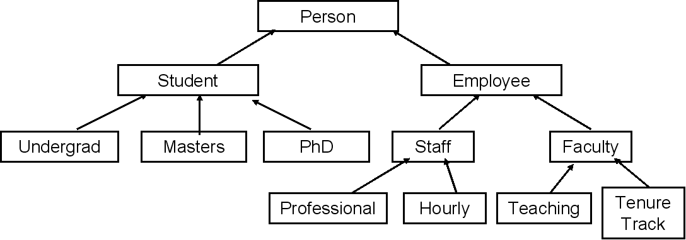

# C++ Class Notes

## Section 5 - Structure of a C++ Program

### Syntax Terms

- keywords are reserved (programmer cannot redefine their meaning)
	- [list of c++ keywords](https://en.cppreference.com/w/cpp/keyword)
	- examples of keywords: `int`, `return`
- Identifiers: something that the programmer names that represents something meaningful to them. Examples of identifiers include function names and variables.
- Operators: An operator in a programming language is a symbol that tells the compiler or interpreter to perform specific mathematical, relational or logical operation and produce final result.
 
 
 ### Preprocessor
- C++ preprocessor is a program that processes your source code before the compiler sees it. The preprocessor
	- strips all comments from the code
	- Executes **preprocessor directives** then removes them from the source code
- Preprocessor directives are lines in source code that begin with a `#`, examples include `#include`
	- Preprocessor directives are often used to include certain libraries or to conditionally compile code. (E.g. you only want to compile certain piles of code
	- **The C++ preprocessor does not understand C++**

### Comments
Comments are programmer-readable notes in the source code. They are often used to explain or annotate code.

- Note: comments never make it to the complier. They are stripped out by the preprocessor.

Styles of comment:

- single line comment. Indicated by `//`
- multi-line comment. Multi-line comments are started with `/*` and ended with `*/`.
	- multi-line comments are typically used to create a header at the top of the code 

Commenting best practices:

- your code should be "self-documenting". Your code should make sense. Use comments to explain code that aren't obvious
- Keep the style of the comments consistent 
- Good commenting doesn't justify bad code
- Don't use comments as version control

### main() function

- Every C++ program must have one `main()` function somewhere.
- When the C++ program executes, the operating system runs `main()`
- If the return value is 0, then the program terminated successfully. If the return value is not 0, then the OS can check the return value and use it to determine what went wrong.
	- `main` must always return an integer
- Two versions of a `main` function. One takes no arguments and the other takes arguments
	- If ```main``` takes in no arguments, then it doesn't expect any information from the operating system.
	- If `main` has arguments, that means it expects arguments from the OS when it is called. `main` will  be in the format `main(int argc, char *argv[])` where
		- `argc` is the number of arguments that `main` expects.
		- `*argv[]` is the argument vector that are the values of the 
		- a program that expects arguments will be called from the command line using the syntax `program.exe arg1 arg2 ...`

### Namespaces

- Namespaces help avoid naming conflicts between functions of the same name. 
- `std` is the name for the C++ 'standard' namespace
- `::` is the scope resolution argument. It is used to specify a namespace. For example to use command `xyz` from namespace `abc`, you would write `abc::xyz`. 
	- It is the equivalent of python's `abc.xyz`.
- `use namespace abc` calls the entire abc namespace. This means that you don't have to type `abc::` before calling any method from that namespace. This is the equivalent of python's `from abc import *`.
	- This can be risky because it increases the risk of naming conflicts
- `using abc::xyz` only brings in the `xyz` method from `abc`. It is the equivalent to Python's `from abc import xyz`.

### Basic I/O using `cin` and `cout`

- `cout` - standard output stream, defaults to console
- `cin` - standard input stream, defaults to keyboard
- `<<` - insertion operator, used with output streams
- `>>` - extraction operator, used with input streams

#### output: `cout` and `<<`
- `<<` inserts the value of the operand to its right into the `cout` output stream

Example: `cout << data` inserts the variable `data` into the `cout` stream

- can chain multiple insertions in the same statement

Example: 
`cout << "data 1 is " << data1;` pushes "data 1 is [value of data 1]" to the console

- insertion operator does not automatically add line breaks. 
	- need to add new line operator (`endl`) or add new line character (`"\n"`)
	- new line operator will also flush the stream


#### input: `cin` and `>>`
- extraction operator (`>>`) extracts information from the `cin` input stream and stores the information in the variable to the right of the operator

Example: `cin >> data'` assigns the value of the (keyboard) input to the variable `data`. The way that the information is interpreted is based on the type of the variable.

- extraction operators can be chained

Example: `cin >> data1 >> data2` assigns the value of the input to the variables `data1` and `data2` basd on their respective types. If, for example, the input from they keyboard is `1` and `data1` is an integer but `data2` is a string, then `data1` will store the integer 1 but `data2` will store the string `"1"`.

- Can fail if the entered data cannot be interpreted
- trailing white space is interpreted as meaning the input is done, but it doesn't clear the buffer. Need to be careful

**Note:** I am confused on how `cin` and white space interact

- white space is ignored (?)
<!--I am unclear if the following is true: - Characters entered using the keyboard will only be processed when the *enter* key is pressed. `cin` also treats white space like hitting *enter*.-->

## Section 6 - Variables and Constants

### Variables

#### Computer Structure
- A computer has memory, a CPU, and a bus that allows the movement of data between them
- RAM is a contiguous block of storage, can be thought of as having memory cells where each cell has an associated location
- Most programming languages allow you to associate a name with a memory location

#### Variable Overview
A variable is an abstraction for a memory language that allow programmers to use meaningful names and not memory addresses.

- Variables have a type (e.g. integer, string, etc.) and a value (e.g. 10, "Text", etc.).
	- The type of the variable must be declared before they are used. 
		- you can use object-oriented programming to create your own variable types
	- The value of a variable may change

#### Naming Rules
- can contain letters, numbers, underscores
- must begin with a letter or an underscore.
	- can **never** begin with a number
- cannot use C++ reserved keywords
- Cannot redeclare a name in the same scope.
- be consistent with your naming conventions
	- your organization may have a style guide
	- use either Camel Case or underscores to separate words. Choose one and stick with it
- avoid beginning names with underscores
- Use meaningful names - not too long or too short
	- make sure your variable names are very descriptive 

[C++ Variable Naming Conventions](https://www.geeksforgeeks.org/naming-convention-in-c/) 

#### Declaring and Initializing Variables

- Best practice to declare a variable near where you first use is.
- Don't use a variable before initializing it. This will cause problems.

`int age;` - uninitialized

Multiple ways to initialize a variable that are all valid:

- `int age = 21;` - C-like initialization
- `int age (21);` - Constructor initialization
- `int age {21};` - C++11 list initialization syntax
	- This is probably the best way to start
	- List initialization helps catch overflow errors

Note: remember that C++ is case sensitive

#### Global Variables
- global variables are automatically initialized to `0`.
- gloabl variables can be accessed by any part of the program
- if there is a local variable with the same name as the global variable, the compiler will use the local variable
- best practice is to avoid global variables when possible

#### C++ Fundamental Data Types

[C++ Variable Types](https://cplusplus.com/doc/tutorial/variables/)

- the size and precision of C++'s primitive data types are largely dependent on the platform you're working on and the complier you are using
- `# include <climits>` should have the size and precision of the data types for your specific compiler
- The more bits allocated to a type, the more values that can be represented and the more storage required
	- need to be careful about overflow 

###### Character
- used to represnt single characters
- Basic `char` data type is 8 bit, but can be bigger if necessary
- C++ uses single quotes (not double quotes) for the single `char` type
	- double quotes makes it a string

###### Integer
- used to represent whole numbers
- both signed and unsigned integers are supported
- different types depending on size/precision needed and if signed or unsigned is need
- by default, all integers are signed

###### Float
- `double`

###### Boolean
- `0` is False
- Anything non-zero is True

#### `sizeof` operator
- the `sizeof` operator tells you the size in bytes of a type or a variabs


### Constants
- constants cannot have their value changed once declaired
	- useful for 
- Like C++ variables, constants have names, occupy storage, are (usually) typed

#### Types of Constants
- literal constants
	- do not refer to variables, they are the values themselves

in the expresion: `const int z {5};`, `z` is a constant and `5` is in integer literal

- declared constants (`const` keyword)
	- `const int months_in_year {12};` 
- constant expressions (`constexpr` keyword)
- enumerated constants (`enum` keyword)
- Defined constants (`#define`)
	- used in legacy C++ code. Don't use in Modern C++ 

## Section 7 - Arrays and Vectors

### Arrays

* An array is a compound data type or data struture - a collection of elements
* All elements must be of the same time (`int`, `double`, etc.)
* Each element can be accessed directly

#### How Arrays Work
- the name of the array represents the location of the first element in the array

```
int numbers [10] {0};
cout << numbers << endl;
```

will output a hexidecimal number corresponding to the memory address.


- The index represents the offset from the beginning of the array
- C++ performs a calculation to find the correct element. Remeber, no bounds checking. 

#### Characteristics of an Array

* Fixed Size
	* if you do not know how many elements you will need to have in your array, then you can make the array large enough that you are not likley to exceed the size
* Ordered
* Elements are all the same type (`int`, `double`, etc.)
* Stored contiguously in memory
* Individual elements can be accessed by their position or index
	* First element at index 0
	* Last  element at index $n-1$
*  Arrays do not check to see if you are out of bounds - if you go over bounds, 
*  Arrays are very efficient
*  Arrays are not commonly used in modern C++

#### Declaring and initializing arrays

Best practices it to initialize arrays when you declare them

##### Declaring: 
###### Format
```
Element_Type array_name [constant integer number of elements]
```

The complier must know the number of items in the array at compile time. The array cannot be sized based off a changing value in the program. 

###### Examples
`int test_scores [5]` creates an array of five elements with the name *test_scores*

```
const int days_in_year {365};  // Creates a constant with the value 365

double hi_temp [days_in_year]; // Creates an array of doubles with the number of elements equal to days_in_year
```

##### Initializing: 
###### Format
```
Element_Type array_name [constant integer number of elements] {init list}
```

This creates an array named *array_name* made up of $n$ elements of type `Element_Type` and that have the values found in the initialization list `{init list}`.

The complier must know the number of items in the array at compile time. The array cannot be sized based off a changing value in the program.

If you have an array of size $n$ and `{init list}` has $m$ elements (where $m < n$), then the first $m$ elements of the array will correspond to the values in `{init list}` and the $m + 1$ to $n$ elements will be initialized to $0$. 

###### Examples
`int test_scores [5] {100, 95, 99, 87, 88};` creates an array of five elements with the name *test_scores* whose elements are the integers *100, 95, 99, 87*, and *88* in that order. 

`int high_score_per_level [10] {3, 5};` creates an array of **10** integers with the name *high_score_per_level*. The first two elements of the array are *3* and *5* and the remaining elements are *0*.

`double hi_temp [days_in_year] {0};` Initializes all the values in the array to 0

`double hi_temp [days_in_year] {};` Initializes all the values in the array to 0

`int another_array [] {1, 2, 3, 4, 5};` If all the elements of the array are provided when compiling, then the size of the array can be automatically calculated  

#### Array Elements

##### Accessing 

```
array_name [element_index]
```

For example, `my_array [4]` would access the fifth (don't forget we are indexing from 0) element in the array *my_array*

##### Reassigning

```
array_name [element_index] = new_value
```

This assigns the chosen element in the array a new value. Note the new value must be of the same `type` as the array.

#### Multi-Dimensional Arrays

##### Initializing and Declaring
```
Element_Type array_name [dim1_size][dim2_size]{init list}
```

For multi-dimensional arrays, the `{init list}` is a list of lists

###### Example

```
int movie_rating [3][4] {
	{0, 4, 3, 5},
	{2, 3, 3, 5},
	{1, 4, 4, 5}
};
```

##### Accessing
To access the nth row and mth column of a 2x2 array, the syntax is: `array_name [n][m]`. This syntax can be extended to arrays of arbitrarily many dimensions


### Vectors

#### Characteristics of Vectors

- Vectors are dynamic arrays meaning they can grow and shrink in size at execution time
- Very efficient
- Vector elements are indivdually accessable
	- Index starting from 0
- No built-in out of bounds checking, but their are functions to do bounds check
- Can use functions like sort, reverse, find, and more
- Vectors are objects 
	- similar syntax to arrays, but slightly different


#### Declaring and Initializing

- Must include the `<vector>` library using the `#include <vector>` preprocessor directive
	- vector types are part of the standard (`std`) library - must use the `std` namespace or the scope resolution operator (`::`). 

##### Syntax

```
vector <type> vector_name;
```

- Do not need to declare the number of elements in the vector
- For vectors containing `integer` and `float`/`double` types, the vector will auto-initialize all elements to 0 if there is not an initialization list 
- There are many other ways to declare vectors


###### Examples

`vector <char> vowels {'a', 'e', 'i', 'o', 'u'};` creates a vector whose initial elements are *a*, *e*, *i*, *o*, and *u*.

`vector <double> hi_temperatures (365, 80.0);` creates a vector that initially has 365 entires all with a value of 80.0.


#### Accessing vectory elements and vector methods

- When you add elements to a vector, you make a copy of what you are inserting

##### Array Syntax

`vector_name [element_index]`

##### `at` method: `vector_name.at(element_index)`

- this is a method in the `vector` object
- the `at` method does provide bounds checking during runtime
 
##### `push_back` method

`vector_name.push_back(new_element)`: appends *new_element* to the end of the vector
- remember: `type(element)` must be the same as all the elements already in the vector

##### `size` method

`vector_name.size()`: tells you how many elements are in the vector

#### Multi-Dimensional Vectors

- a mult-dimensional vector is a vector of vectors

```
vector <vector <int>> movie_ratings {
	{0, 4, 3, 5},
	{2, 3, 3, 5},
	{1, 4, 4, 5}
};
```

- can use array syntax, or the `at` method to access an element

`movie_ratings[2][3]` and `movie_ratings.at(2).at(3)` both access the element in the 3rd row and 4th column of *movie_ratings*.

[Initializing Vectors](https://www.freecodecamp.org/news/cpp-vector-how-to-initialize-a-vector-in-a-constructor/)

## Section 8 - Expressions, Statements, and Operators 

### Expressions

- most basic building blocks in programming
- a sequence of operators and operands that compute a value

### Statements and Block Statements

- a complete line of code that performs some action
- usually terminated with a semi-colon


Examples: declaration, assignment, expression, if statement

### Operators

- assignment operator `=`: assigning the right hand side of an expression to the left hand side of an expression. 
	- the statement `a = 10;` assigns the value of 10 to the variable `a`.
	- Do not confuse assignment with initialization. Assignment changes the value of an existing variable.
		- l-value - the contents of a value
		- r-value - the location of that variable
	- can chain expressions together: `a = b = 10;` assigns 10 to `b` and returns `10`, it then assigns 10 to `a`
		- assignment operators and expressions return the value that was assigned
		- assignment operators and expressions associate right to left 
		- chaining is generally not a good idea
- arrethmatic operators (`+`, `-`, `*`, `/`, `%`)
	- no built-in exponential operator
	- Modular operator (`%`) only works with integers
	- be careful when doing division with integers - C++ will always truncate off any decimal that occurs in operations between two integers. 
	- For example:


	```
	5/10 // Ouputs 0
	
	5.0 / 10.0 // Outputs 0.5
	```
	 
	- Order of operations is still PEMDAS

#### Increment and Decrement Operator

##### Increment Operator (`++`)

- means: increase value by 1
- can be used with integers, floating point numbers, or pointers
- Prefix notation: `++num` - increment variable before you use it
	- Example 1:

		```
		counter = 10		
		result = ++counter
		
		cout << counter << endl; // outputs 11
		cout << result << endl; // outputs 11
		``` 	 
	- Example 2:
		
		```
		result = ++counter + 10;
		```
		
		Is the equivalent of saying
		
		```
		counter = counter + 1;
		result = counter + 10;
		```
		
		Meaning, in the example:
		
		```
		counter = 10		
		result = ++counter + 10
		
		cout << counter << endl; // outputs 11
		cout << result << endl; // outputs 21
		``` 	
		
- Postfix notation: `num++` - increment variable after you use it
	- Example 1: 	

		```
		counter = 10		
		result = counter++
		
		cout << counter << endl; // outputs 11
		cout << result << endl; // outputs 10
		``` 	
		
	- Example 2:
		
		```
		result = counter++ + 10;
		```
		
		Is the equivalent of saying
		
		```
		result = counter + 10;
		counter = counter + 1;
		```
		
		Meaning, in the example:
		
		```
		counter = 10		
		result = counter++ + 10
		
		cout << counter << endl; // outputs 11
		cout << result << endl; // outputs 20
		``` 	
		
		
		--
	
- Be careful with this operator. 
- Don't use twice with the same variable in the same statement


#### Decrement Operator (`--`):

same as the increment operator except it decreases value by 1

### Mixed Type Expressions
- C++ operations occur on the same type operands - if operands are of different types, C++ will convert one
	- Be careful of this. It could affect calculation results
	- C++ will attempt to automatically convert types. If it can't, a complier error will occur

#### Conversions
- Higher vs. lower types are based on the size of the values the type can hold
	- `long double` > `double` > `float` > `unsigned long` > `long` > `unsigned int` > `int`
	- `short` and `char` types are always converted to int
- Type Coercion : conversion of one operand to another data type
	- promotion: conversion to a higher type (the lower types value should fit into the higher types value)
		- used in mathematical expressions
		- Example: doing math with a double (`beta`) and an integer (`alpha`)

		```
		int alpha {5};
		double beta {10};
		
		cout << alpha / beta << endl; \\ outputs the double 0.5
		cout << alpha + beta << endl; \\ outputs the double 15
		```
			
	- Demotion: conversion to a lower type
		- Used with assignment to a lower type   

		Example: assigning a double literal (`1.5`) to integer variable (`alpha`).

		```
		int alpha {0};
		
		alpha = 1.5;
		
		cout << alpha << endl \\ outputs the integer 1
		```
		
	- Explicit Type Casting - `static_cast<type>`

		```
		int total_amount {100};
		int total_number {8};
		double average {0.0};
		```
		
		```
		average = total_amount / total_number;
		cout << average << endl;  // displays 12
		```
		
		Even though `average` is a double, it only displays 12 because `total_amount / total_number` is dividing two integers division, leading to the truncated result 12. This code could be rewritten as:
		
		```
		int temp {0};
		temp = total_amount / total_number
		
		cout << temp << endl; // outputs 12
		
		average = temp;
		cout << average << endl; // outputs 12
		```
		
		You can use `static_cast<type>(variable)` to convert one data type to another.
		
		```
		average = static_cast<double>(total_amount) / total_number;
		cout << average << endl;  // displays 12.5
		```
		
		In this case, `static_cast<double>(total_amount)` converts `total_amount` from an `int` into a `double`. This means that the subsequent division `total_amount / total_number` is not dividing to integers but rather dividing a double by an integer. This causes `total_number` to get promoted to a double as well. The resulting output is therefore a double. `static_cast<type>` is a cleaner way of doing:
		
		```
		int total_amount {100};
		int total_number {8};
		double average {0.0};
		
		double total_amount_double = total_amount; // create a double type variable with the same value as total_amount
		
		average = total_amount_double / total_number;
		
		cout << average << endl;  // displays 12.5		
		```

### Comparison Operators

| Operator | Meaning                  |
|----------|--------------------------|
|    ==    | Equal To                 |
|    !=    | Not Equal To             |
|     >    | Greater Than             |
|     <    | Less Than                |
|    >=    | Greater Than or Equal To |
|    <=    | Less Than or Equal To    |

These operators compare the left side of the expression to the right side of the expression and see if the comparison is true or false. The result is the corresponding boolean.

For example: `a == b;` outputs true (`1`) if `a` and `b` have the same value and outputs false (`0`) if `a` and `b` do not have the same value.

- you can compare two values of different types (e.g. a `double` and an `int`). This is because the `int` gets promoted to a `double`
- when comparing doubles, be careful about approximations of numbers:`12.0 == 11.999999999999999999` may return `true` because of how computer approximate floating point numbers
- You can use `boolalpha` command to convert the ouput from `0` and `1` to `false` and `true`. The `noboolalpha` command converts the output from `false` and `true` to `0` and `1`. These commands are located in the `std` namespace. 

```
cout << (num1 == num2) << endl; // displays 0 or 1

cout << std::boolalpha; 
cout << (num1 == num2) << endl; // displays true or false

cout << std::noboolalpha;
cout << (num1 == num2) << endl; // displays 0 or 1
```

- `<=>` is a three-way comparison operator that was introduced in C++20. `a <=> b` outputs:
	- a value less than zero if `a` is less than `b` 
	- a zero (0) if `a` is equal to `b` 
	- a value greater than zero if `a` is greater than `b` 

### Logical Operators

NOT, AND and OR

- Operate on boolean expressions and evaluate to a boolean operator themselves
- each operator can be written by its keyword syntax or using the operator symbol syntax 
	- most code uses the operator syntax

| Operator    | Keyword Syntax | Operator Syntax |
|-------------|----------------|-----------------|
| Logical NOT | not            | !               |
| Logical AND | and            | &&              |
| Logical OR  | or             | \|\|            |


Precedence (Order of Operations)
- `not` has higher precedence than `and`, which has higher precedence than `or` (`not` > `and` > `or`)
	- to be safe, use parenthesis to make sure that your meaning is clear 
- `not` is a unitary operator
- `and` and `or` are binary operators

```
alpha >= 10 && alpha < 20 // returns true if 10 <= alpha < 20
```

**Short-Circuit Evaluation:** when evaluating a logical expression C++ stops as soon as the result is known

Examples:

```
// expr1, expr2, expr3 are expressions that evaluate to booleans
expr1 = false
expr2 = true
expr3 = true

expr1 && expr2 && expr3 

```

In the above example, `expr1` evaluates to `false` which means that `expr1 && expr2 && expr3` can never be true. C++ will therefore only evalue `expr1` (note, `expr1`, `expr2`, and `expr3` are stand-ins for expressions that will evaluate to a boolean.

```
expr1 || expr2 || expr3
```

In the above example, C++ will only evaluate `expr1 || expr2` because `expr1 || expr2` evaluates to `true` which means that `expr1 || expr2 || expr3` can never be true.

### Compount Assignment Operators

Compound assignment operators combine performing some operation and assignment into one step. The format `op=`, where *op* is the stand in for an operator.

| Operator | Example  | Meaning     |
|----------|----------|-------------|
| `+=`     | `a += b` | `a = a + (b)` |
| `-=`     | `a -= b` | `a = a - (b)` |
| `*=`     | `a *= b` | `a = a * (b)` |
| `/=`     | `a /= b` | `a = a / (b)` |
| `%=`     | `a %= b` | `a = a % (b)` |

In the above table, `b` refers to the entirety of the right hand side. Treat it as if it were in parentheses

Note: this is not all the operators that can work as compound operators. 

### Operator Precedence

- Operator precedence is which operators are higher in the list of order of operation (e.g. multiply before you add)
- *associativity* is the "left to right" or "right to left" aspect of the order of operations for operators with the same precedence
	- e.g. you always do multiplication and division left to right
- Best bet is to use parenthesis to remove any confusion

Please see [this link](https://en.cppreference.com/w/cpp/language/operator_precedence) for a table documenting operator precedence and associativity in C++.

[This link](https://www.programiz.com/cpp-programming/operators-precedence-associativity) also has the table as well as a bit of an explanation.

## Section 9 - Controlling Program Flow

### If Statements

```
if (condition1) {
  // block of code to be executed if condition1 is true
} else if (condition2) {
  // block of code to be executed if the condition1 is false and condition2 is true
} else {
  // block of code to be executed if the condition1 is false and condition2 is false
}
```

### Switch-Case Statement

Switch Statement 

```
switch(control_expression) {
  case x:
    // code block
    break;
  case y:
    // code block
    break;
  default:
    // code block
}
```

- `switch` expression is evaluated once, the value of the expression is compared with the values of each `case`
	- `control_expression` and `case` must evaluate to an integral type or an `enumeration` type
		- `integral` type includes whole numbers and characters
		-	[enumeration type](https://www.geeksforgeeks.org/enumeration-in-cpp/)
	- `case` statements must be known at compile time - must be constant or literals
- If there is a match, the associated block of code is executed

	```
	int day = 4;
	switch (day) {
	  case 1:
	    cout << "Monday";
	    break;
	  case 2:
	    cout << "Tuesday";
	    break;
	  case 3:
	    cout << "Wednesday";
	    break;
	  case 4:
	    cout << "Thursday";
	    break;
	  case 5:
	    cout << "Friday";
	    break;
	  case 6:
	    cout << "Saturday";
	    break;
	  case 7:
	    cout << "Sunday";
	    break;
	}
	// Outputs "Thursday" (day 4)
	```

- the `break` and `default` keywords are optional
	- `break` keyword breaks out of the switch block. This will stop the execution of more code and case testing inside the block. Best practice is to include them.
		- when a match is found, there is no need for more testing
		- a break can save a lot of execution time because it "ignores" the execution of all the rest of the code in the switch block
	- `default` keyword specifies some code to run if there is no case match
		- `break` statement is not needed in the default case

		```
		int day = 4;
		switch (day) {
		  case 6:
		    cout << "Today is Saturday";
		    break;
		  case 7:
		    cout << "Today is Sunday";
		    break;
		  default:
		    cout << "Looking forward to the Weekend";
		}
		// Outputs "Looking forward to the Weekend"
		```

If declaring a variable within the case statment, then you need to have the code for that statement within `{ }` 
[Link](https://www.w3schools.com/cpp/cpp_switch.asp) with more information on C++ switch statements'


```
switch (selection) {
	case '1': cout << "1 selected";
				break;
	case '2': cout << "2 selected";
			break;
	case '3': 
	case '4':
		cout << "3 or 4 selected";
		break;
	default:	cout << "1, 2, 3, 4 NOT selected";
```

Notice how in the above example, the `cout` statement in `case 4` also applies to `case 3`. It functions as an OR statement.


### Conditional Operator (`?`)

```
(cond_expr) ? expr1 : expr2
```

- `cond_expr` evaluates to a boolean expression
	- if `cond_expr` is true then the value of `expr1` is returned
	- if `cond_expr` is false then the value of `expr2` is returned
-  This is very similar to an `if-else` construct
-  Ternary operator
-  Very useful when used inline
	- can make code a lot cleaner   
-  Easily abused - never nest

[Useful Link](https://www.w3schools.com/cpp/cpp_conditions_shorthand.asp) helping explain the conditional operator.

Exmaple: Use to avoid a divide by 0 error
	```
	int result = (b != 0) ? (a/b) : 0;
	```

Example: Display the larger of two numbers

	```
	int num1{}, num2{}
	cout << "Enter two integers separated by a space: ";
	cin >> num1 >> num2;
	
	if (num1 != num2){
		cout << "Largest: " << ((num1 > num2) ? num1: num2) << endl;
	}
	else {
		cout << "The numbers are the same"
	} 
	```


### For Loops

Used for iterating a specific number of times

```
for (initialization; condition; increment) {
  // code block to be executed
}
```

- `initialization` is executed (one time) before the exection of the code block
- `condition` defines the condition for executing the code block. This conditional statement is checked every time and must evaluate to `true` for code in the loop to be executed.
- `increment` is executed (every time) after the code block has been executed
- All of these expressions are technically optional

Example: print the numbers 0 to 4
	```
	for (int i = 0; i < 5; i++) {
	  cout << i << "\n";
	}
	```

- `int i = 0;` initializes a variable `i` with a value `0`. This happens only once before executing the `for` loop
	- it is common to use `i` as the increment value 
	- if you initialize the increment variable in the for loop then it only exists in the loop
- `i < 5;` check to make sure that `i` is less than `5`.
- `i++`; increment `i` by one every time you finish the code block
	- in this case `i++` and `++i` are the same because the statement is on its own

	
Comma operator (`,`): allows you to separate expressions with a `,` and all the expressions will execute

- not commonly used in C++ but sometimes used to initialize variables
- associativity is right to left
- result of the comma operator is the leftmost expression

```
for (int i {1}, j{5} ; i <= 5; i+=2, j++){
//code goes here
}
```

#### Looping over an vecor:

One way to do it

```
vector<int> nums {1, 2, 3, 4, 5};

for (unsigned i {0}; i < nums.size(); i++){
	// code goes here
}
```

#### Range-based for loop / for-each loop

Want to be able to iterate over the entirety collection of elements without having to worry about the sequence length, incrementing/decrementing variables, or subscripting indices.

- this works for arrays, vectors, and strings

**Syntax:**

```
for (type variable_name : sequence_name){
	// code goes here
}
```

Example:

	```
	int myNumbers[5] = {10, 20, 30, 40, 50};
	for (int i : myNumbers) {
	  cout << i << "\n";
	}
	```

Don't always have to give the type of the variable corresponding to the elements of the array. You can use the `auto` keyword and the compiler will figure it out.

```
int scores [] {100, 90, 97};

for (auto i : scores){
	cout << i << endl;
}

```

The range-based for loop is equivalent to the `for variable in sequence:` for loop syntax in python.

### While Loop

```
while (condition){
	// code block to be executed
}
```

While loops continue as long as the condition evaluates to true. The condition is evaluated at the beginning of each iteration of the loop.

`while` loops can be constructed to have the same format as a `for` loop, but it is generally better to use a `for` loop than a `while` loop when possible. --> Use the `for` loop when we know how many times we need to loop and use the `while` loop when you don't

`while` loops are often used to do input validation (using a boolean flag).

example:

```
bool done {false};
int number {0};

while (!done){
	cout << "Enter an integer between 1 and 5: ";
	cin >> number;
	
	// if the integer is not between 1 and 5, prompt the user again
	if (number <= 1 || number >= 5){
		cout << Out of range, try again." << endl;
		}
	
	// if the integer is between 1 and 5, thank the user and then change the boolean flag to true, breaking out of the while loop
	else {
		cout << "Thanks!" << endl;
		done = true;
	}
}
```

### Do While Loop

```
do {
  // code block to be executed
}
while (condition);
```

The condition is checked at the end of each statment, this guarantees the code block is executed at least once before checking if the condition is true.

Can be used for input validation:

```
int number {};
do {
	cout << "Enter an integer between 1 and 5 (not inclusive): ";
	cin >> number;
	cout << endl;
} while (number <= 1 || number >= 5);

cout << "Thanks" << endl;
```

Often used in menu based programs. Those can also use `switch` statements too.


### Continue and Break

`continue` 

- no further statements in the body of the loop are executed
- control immediately goes directly to the beginning of the loop for the next statement

`break`

- no further statements in the body of the loop are executed
- loop is immediatley terminated
- control immediatley goes to the statement following the loop construct


### Infinite Loops
- Control statement whose condition always evaluate to true
- Often accidental, but sometimes done intentionally
	- Intentional infinite loops are often used with break statements to exit out when a certain condition is met
		- be careful with this. It's often just to structure your loop and your condition to not require this.

Example: Loop through a block of code until the user no longer wants to continue.

```
while (true){
	// main body of code goes here
	
	// check to see if you want to loop again
	char again {};
	cout << "Do you want to loop again? (Y/N): ";
	cin >> again;
	
	// check input from user
	while (!(again == 'Y' || again == 'y' || again == 'N' || again == 'n')){
	cout << "Error: Incorrect Value" << endl;
	cout << "Please enter either ('Y' or 'N'): ";
	cin >> again;
	}
	
	if (again == 'N' || again == 'n'){
		break;
	}
}
```

You could rewrite this code as:

```
char again {Y};

while (again == 'Y' || again == 'y'){

	// main body of code goes here
	
	// check to see if you want to loop again
	cout << "Do you want to loop again? (Y/N): ";
	cin >> again;
	
	// check input from user
	while (!(again == 'Y' || again == 'y' || again == 'N' || again == 'n')){
	cout << "Error: Incorrect Value" << endl;
	cout << "Please enter either ('Y' or 'N'): ";
	cin >> again;
	}
	
}
```

## Section 10 - Characters and Strings

- Characters are values that map to character sets
- Strings are sequences of characters
	- There are C-style strings and C++ - style strings


### Character Functions

`cctype` library contains useful functions for testing characters and for converting character case

Syntax: `function_name(char)` - functions take in a single character

 - [list](https://cplusplus.com/reference/cctype/) of `cctype` character functions

### C-Style Strings

- sequence of characters stored contiguously in memory
- implemented as nrray of charcters terminated with null character
	- referred to as zero or null termianted strings
	- you can use array notation to access specific characters
	- C-style strings are fixed lenth
- string literal - sequence of characters in double quotes (e.g. `"Jack"`)
	- you can use 
	- null characters compares equal to zero

#### Declaring variables

```
char my_name [] {"Jack"}; // stored as an array with elements [J a c k \0]

my_name[2]; // returns a

my_name[4] = y; // this causes a problem because you replace the /0 with a y and the string is no longer null terminated

```

```
char my_name[7] {"Jack"}; // stored as an array with elements [J a c k \0 \0 \0]

my_name[4] = y; // no problem with this because the string still is null terminated
```

You cannot initialize a C-style string by assigning it to a literal. To assign one string to another, you need to use `strcpy(string_name, literal)

```
char my_name [8];

cout << my_name; // Will likely get garbage

my_name = "Jack" // Error
strcp(my_name, "Jack"); // OK
```

`<cstring>` library contains functions that work wtih C-style Strings. 

- requries that each string be terminated with a null character
- these functions include functions tat cop, concatenate, etc
- [list] (https://cplusplus.com/reference/cstring/) of functions in `<cstring>` library

`<cstdlib>` contains functions that converts strings to other types


Best practice is to always initialize a string: `char string_name[n] {};` where $n$ is an integer. If you initialize a then you can assign it a value.

```
char my_name[10] {};

my_name = "Jack"; //OK

//my_name is now an array consisting of [J a c k /0 /0 /0 /0 /0 /0]

cout << my_name // displays Jack
```

`strlen(string)` returns something of a type `size_t`. `size_t` is a data type usedto represent teh size of an object.

Your strings need to be null-terminated or else you will run into problems

#### Other Notes
`cin` only takes in information before a space. If you want to be able to have a space in your input, you need to use `cin.getline(string_name,max_characters_to_read)`

```
char full_name [50] {};

cout << "Enter your first and last name: "
```

Let the user input be: Jack Kaplan

```
cin >> full_name
cout << full_name // prints "Jack"
```

```
cin.getline(full_name, 50)
cout << full_name // prints Jack Kaplan
```

### C++ Strings

Whenever possible, is better to use C++ strings than to use C-style strings

- `string` is a Class in the standard template libarary (STL)
	- need to use `#include <string>`
	- in the std namespace 
	- contiguous in memory
	- dynamic size
	- work with input and output streams
	- lots of useful functions
	- our familiar operators can be used (`+`, `=`, ... )
	- Can be easily converted to C-style strings if needed
	- safer
- strings are objects
	
[Webpage with C++ String Information] (https://www.w3schools.com/cpp/cpp_strings.asp)

#### Initializing

Assume that all code begins with the following preprocessor terms 

```
#include <string>
using namespace std;
```

```
string s1; // Empty - Not Garbage!
string s2 {"Jack"} // Jack
string s3 {s2} // Jack (copy of s2)
string s4 {"Jack", 3}; // Jac
string s5 {s3, 0, 2}; // Ja - The numbers refer to the starting index and the length, respectively
string s6 {s3, 1, 2}; // ac
string s7 (3, 'X'); // XXX
```

#### Assignment

Can use assignment operators (unlike with C-style strings). Don't have to use 

```
string s1;
s1 = "C++ Rocks!"; 
cout << s1; //C++ Rocks

string s2 {"Hello"}; 
cout s2; //Hello
s2 = s1; //Assigns acopy of s1 to s2
cout << s2; // C++ Rocks
```

#### Concatenation

- Can use `+` or the `append()` method to concatenate strings
- can only concatenate C++ style strings, cannot concatenate two (or more) C-style literals

```
string part1 {C++};
string part2 {"is a powerful"};

string sentence;

sentence = part1 + " " + part2 + " language";
// C++ is a powerful language

sentence = "C++ " + " is powerful"; //Illegal, cannot concatenate C-style literals
```

- compound assignment operator (`+=`)

#### Accessing Characters

- can use array index syntax `[]` or `at()` method
- `at` method provides bounds checking, array-style syntax does not
- `substr()` extracts a substring from a larger string
- `find()` method - returns the index of a substring in a string
- `erase()` method - removes a substring of characters from a string
- `clear()` method empties a string
- `length()` method returns the number of characters in the string object

#### Comparing Strings

- don't forget that `char` types are representations of integers from an ascii (or other) source
- use the normal comparator operators (`==`, `>`, `<`, etc.)
- objects are comperd character by character lexically
	- `A` < `Z` and `A` < `a` because of their ascii representation
	- compares character by character

``` 
string s1 {Apple};
string s2 {Banana};
string s3 {apple};

s1 < s2; \\ returns true because A comes before B in the ascii table

s2 < s3; \\ returns true because B comes before a in the ascii table

s1 == s3 \\ returns false becase "Apple" is not the same as "apple"


```

- Can compare
	- two C++ string objects
	- a C++ string and a C-style string literal
	- a C++ string and a C-style string variable  

#### Input

Like with C-style strings, C++ strings only accept up to the first space when using `cin`. 

The `getline()` function reads the entire line until the `\n`. `getline()` expects two parameters. 

- the first is the input stream. In this case it is `cin`
- the second is the variable that it is assigning the input to
- a third (optional) parameter is called the delimiter. It is the character at which `getline()` stops reading input. It defaults to `\n` but it could also be manually chosen. It will not save this character to the string variable. 

```
string s1;
cin >> s1; // User input "Hello There"
cout << s1 << endl; // Prints: Hello

getline (cin, s1); // reads the entire line up unitl \n
cout << s1 << endl; // Prints: Hello There

getline (cin, s1, 'x'); // User input: This isx
cout << s1 << endl; // Prints: This is
```


## Functions

### Overview

- Boss/Worker analogy
- To use a function, you need to understand:
	- What the it does
	- What information it needs
	- What it returns
	- What errors it may produce
	- What performance constraints it may have 
- You do not need to worry about how the function works internally unless you are the one creating a function


- `<cmath>` - mathematics library ([link](https://cplusplus.com/reference/cmath/))
- [Overview of Functions](https://www.w3schools.com/cpp/cpp_functions.asp)

### Function Definition


#### Parts of a Function
- name - the name of the function
	- same naming convention rule as variables
	- make name meaningful/descriptive
	- usually a verb or verb phrase 
- parameter list - variables passed into the function
	- their type must be specified
- return type - the type of data that is returned from the function
- body - the statements that are executed with the function is called

#### Syntax:


```
return_type func_name(parameter_type parameter){

	//body goes here

}

```

- This is called the function header
- `return_type` is the data structure type that the function returns
	- for functions that don't return anything, the `return_type` is `void`. 
- `func_name` is the function name
- `parameter_type` is the data type that `parameter` will be. 
	- There can be (functionally) infinitely many parameters. Each `type` `parameter` pair will be separated by commas.
	- If a function does not have any parameters, there will be nothing in the `()`
	- `void myFunction()`
	- Functions that do not return anything can still have a return statement but do not have to

	```
	void myFunction(){
		// body of function
		
		return; //optional
		
		}
	```


The compiler must know the function details before it is called. There are two ways to accomplish this.

- Have a function prototype above `main` that contains everything except the body of the code.

example:

```
void my_func();

int main(){
	my_func();
	return 0;
}

void my_func(){
	cout << "Hello World!" << endl;
}
```

- Write the function above the function that calls it.


### Prototypes

- Tells the compiler what it needs to know without a full function definition
- Placed in the beginning of the program
- Also used in our own header (.h) files - for when we split up 
- the prototype has to provide the complier with:
	- the function name
	- the function return type
	- the parameter type(s) - It can provide the name of the parameter itself but this is optional
	- `int funcion_name(int);` and `int function_name(int alpha);` are both valid prototypes of a function that takes in a single integer `alpha` and returns an integer.
	- best practice, however, is to provide the parameter name for documentation purposes
- When you call the function, you must match the prototype

### Parameters

- when we call a function we can pass in data to that function
	- when you call the function they are called **arguments**
	- in the function definition they are called **parameters**
	- the arguments and parameters must match in number, order, and type
		- the function will try to convert types to make the function call work (e.g. if you pass an `int` to a function that expects a `double`-type argument, the program will convert an `int` to a `double`)
			- `char` values may be converted to `int` type corresponding to ASCII value 

#### Pass by Value

- the value of the data is passed in by `copy` - the complier makes a copy of the data
	- whatever changes you make to the parameter in the function does not affect the argument that was passed in
	- making a copy can be expensive

- Formal vs. Actual Parameters
	- formal parameters - the parameters defined in the function header
	-  actual parameters - the parameters used in the function call, the arguments
	-  The actual parameters are "passed by value" or copied to the formal parameters

```
int main(){
	int actual {50};
	cout << actual << endl; // 50
	param_test(actual); // pass in 50 to param_test
	cout << actual << endl; // 50 - did not change
	return 0
}

void param_test (int formal){ // formal is a copy of actual

	cout << formal << endl; // 50
	formal = 100; // only changes the local copy
	cout << formal << endl; // 100
	
}

```

#### Default Argument Values

- When a function is called, all arguments must be supplied
- Sometimes some of the arguments have the same values most of the time - we can tell the compiler to use default values if the arguments are not supplied.
- Default values can be in the prototype or definition, not both
	- best practice is to declare them in the prototype
	- must appear at the tail end of the parameter list (after the parameters without default values)
	- a function can take in multiple arguments with default values. They must appear consecutivley at the tail end of the parameter list 
- functions with default arguments can be overloaded, but be careful

##### Single Default value
```
double calc_cost (double base_cost, double tax_rate = 0.06); // Prototype assigns a default value to tax_rate of 0.06

double calc_cost (double base_cost, double tax_rate){ //function header does not include default value because it is already included in the prototype

	return base_cost += base_cost * tax_rate;
	
}

int main() {
	double cost {0};
	cost = calc_cost(100); // will use default for tax_rate
	cost = calc_cost(100, 0.08); // will use 0.08 for tax rate
}
```

##### Multiple Default Arguments

```
double calc_cost(double base_cost = 100.0, double tax_rate = 0.06, double shipping = 3.50) //default values set in prototype

double calc_cost (double base_cost, double tax_rate){ //function header does not include default value because it is already included in the prototype

	return base_cost += base_cost * tax_rate;
	
}

int main() {
	double cost {0};
	cost = calc_cost(); // uses default values for both 
	cost = calc_cost(125); // will use 125 for base_cost and default for tax_rate
	cost = calc_cost(100, 0.08); // will use 100 for base_cost and 0.08 for tax rate. No defaults
}

```

Unlike python, there is no way use the default value for any argument to the left of the rightmost argument that has been defined. E.g. in the above example you could not use the default value of `base_cost` but input a new value for `tax_rate`. Therefore, if more than one default argument exists, the leftmost default argument should be the one most likely to be explicitly set by the user.

### Return Statment

- if a function returns a value then it must use a `return` statement that returns a value of the same type in the function header
	- if a function does not return a value (`void`) then the `return` statement is optional
- `return` statement can occur anywhere in the body of the function
- 	`return` statement immediately exits the function
-  We can have multiple `return` statements in a function - often the result of conditional logic
	- be careful with this  
-  the return value is the result of the function call 
	- 	`value = my_func(parameter);`  

### Overloading Functions

- Functions with different parameter lists that have the same name - good use of abstraction
- A type of polymorphism - have the same name work with different data types to execute similar behavior
	- ex: if you want to be able to print a variable regardless of if it is an `int`, `double`, `string`, etc.
- The complier must be able to tell the functions apart based on the parameter lists and arguments supplied
- You need to implement each function (we will talk about function templates later)
- Be careful when using with default arguments. Only have one of the functions (maximum) with a default

Example:
```
int plusFuncInt(int x, int y) {
  return x + y;
}

double plusFuncDouble(double x, double y) {
  return x + y;
}

int main() {
  int myNum1 = plusFuncInt(8, 5);
  double myNum2 = plusFuncDouble(4.3, 6.26);
  cout << "Int: " << myNum1 << "\n";
  cout << "Double: " << myNum2;
  return 0;
}
```

- The `return` type is not considered when the compiler is deciding which function to call.
	- the compiler can only tell between the different implementations based on the arguments 


```
int get_value();
double get_value();

cout << get_value() << endl; //Error: the compiler doesn't know which version to call
```

### Passing Arrays

- we can pass an array to a function by providing square brackets in the formal parameter description 
	- `void print_array (int numbers []);`
- Array elements are **NOT** copied
			  
	- since the array name evaluates to the location of the array in memory, this address is what is copied
		- The function has no idea how many elements are in the array since all it knows it the location of the first element (the name of the array)

	```
	void print_array(int numbers []);
	
	int main () {
		int my_numbers[] {1,2,3,4,5};
		print_array(my_numbers);
		
		return 0
	}
	
	void print_array(int numbers[]){
		//The compiler doesn't know know many numbers are in the array
		// we need to pass in the size
	}
	```  
	- to fix this, we need to pass in a size parameter

	```
	void print_array(int numbers [], size_t size);
	
	int main () {
		int my_numbers[] {1,2,3,4,5};
		print_array(my_numbers, 5);
		
		return 0
	}
	
	void print_array(int numbers[], size_t size){
		for size_t i = 0; i < size; i++){
			cout << numbers[i] << endl;
		}
	}
	```  

	- since we are passing the location of the array, the function can modify the actual array
		- this can be useful, but we need to be careful
		- to avoid accidentally changing the array, you can  define the parameter to be `const`

	```
	void print_array (const int numbers [], size_t size){
		for (size_t i{0}; i < size; i++){
		cout << numbers[i] << endl;
		
		numbers[i] = 0; // any attempt to modify the array will result in a compiler error
		}
	}
	```

### Pass by Reference

- default when passing a function is pass by value - the function receives a copy of the passed argument's value
- Sometimes we want to be able to change the actual parameter from within the function body - to do this we need the address of the actual parameter
	- this is what happened when we passed arrays because the array's value is the location of the first element in the array
- We can use reference parameters (`&param_name`) to pass in a reference to the actual parameter
- The formal parameter will not be an alias for the actual parameter

syntax:

```
type my_func (type &parameter);


type my_func(type &parameter){
	// body goes here
}

```


Adding a `&` in front of the parameter name in the prototype and function heading passes the parameter reference rather than a copy of the parameter's value. You continue to use the regular parameter name in the function body. For example:

```
void scale_number (int &num); //prototype

int main() {
	int number {1000};
	cout << number << endl; // 1000
	scale_number(number); // call scale_number
	cout << number << endl; // 10
	return 0;
}

void scale_number (int &num){ //definition
	num = 10;
}
```

#### Vector Example 

##### Pass by Value

```
void print(vector<int> v);

int main(){
	vector<int> data {1,2,3,4,5};
	print(data); // 1 2 3 4 5
	return 0;
}

void print (vector<int> v){
	for (auto num: v){
		cout << num << endl;
	}
}
```

Notice that in the above pass by value example you don't need to pass the size information becaue that is contained in the vector object. Because it makes a copy, this code has much more overhead than passing the vector by reference.
 
##### Pass by Reference

```
void print(vector<int> &v);

int main(){
	vector<int> data {1,2,3,4,5};
	print(data); // 1 2 3 4 5
	return 0;
}

void print (vector<int> &v){
	for (auto num: v){
		cout << num << endl;
	}
}
``` 

Other than adding the `&`, the code for the passing a vector by reference is the exact same as the code for passing a vector by value. To protect against accidentally changing the vector in the pass by reference example, you could always make the vector a constant. 

```
void print(const vector<int> &v);

int main(){
	vector<int> data {1,2,3,4,5};
	print(data); // 1 2 3 4 5
	return 0;
}

void print (const vector<int> &v){
	for (auto num: v){
		cout << num << endl;
	}
}
``` 

### Scope Rules

- scope rules determine wehre an identifier can be used
- C++ uses static or lexical scoping - scope is determined the way that you read a program

Upshot: when looking for a value, look within the local block. If you don't find it, look one block more global. Continue looking more globally, one nested block at a time, until you either find the variable you are looking for or you have a compiler error. 

- The most local variable possible is used first. If you have a local variable and a global variable with the same name, then your program will use the local variable.

#### Blocks
[block](https://www.learncpp.com/cpp-tutorial/compound-statements-blocks/) (also called compound statements) is a group of *zero or more statements* that are treated by the complier as if it were as single statement

- blocks begin with `{` and end with a `}` with the statements to be exectued placed inbetween
- blocks are often used to deliminate functions or loops, but they can be used wherever a single statement is allowed.
- No semicolon is needed at the end of the block


#### **Local Scope**

identifiers declared in a block (`{}`) 

- function parameters have block scope - only visible in the block (`{}`) where declared
	- this also occurs in loops - variables that are declared inside a loop denoted by `{}` are destroyed upon exiting that loop
- Functionl local variables are only active when the function is executing
- Local variables are not preserved between function calls
- With nested blocks, inner blocks can "see" identifiers declared in outer blocks but outer blocks cannot "see" values declared in inner blocks.

```
int main(){

	int num {100}; //local to main
	int num1 {500}; // local to main
	
	cout "Local num is: " << num << " in main" << endl; // 100
	
	{ // create a new level of scope		
		int num{200}; // declare a num that is local to this block
		cout << "local num is: " << num << " in inner block in main" << endl; // 200
		cout << "Inner block in main can see out - num1 is: " << num1 << endl; // 500 - local block can see out
	}

	cout "Local num is: " << num << " in main" << endl; // 100, 
	// num variable declared in inner block is destroyed and we revert to initial declartion

}
```

##### **Static local variables**: variable whose lifetime is the lifetime of the program but it is only visible to the statements in the function body
- declared with `static` qualifier 
	- e.g. `static it value {10};`
- Value is preserved between function calls
- Only initialized the first time the function is called
- useful when you need to know the value of a previous function call

```
void test()
{
    // var is a static variable
    static int var = 0;
    ++var;

    cout << var << endl;
}

int main()
{
    
    test(); // outputs 1
    test(); // outputs 2

    return 0;
}

```

#### Global Scope

- identifier declared outside of any function or class
- visible to all parts of the program after the global identifier has been delcared
- Global constants are OK
- Best practices is not to use global variables ([explanation - why global variables are evil](https://www.learncpp.com/cpp-tutorial/why-non-const-global-variables-are-evil/)]


### How Function Calls Work

- Function use the *function call stack*
	- stack is analogous to a stack of books
	- LIFO - last in first out
		- push - adds an item to the top of the stack
		- pop - removes an item from the top of the stack
- Stack Frame or Activation Record
	- each time a function is called, you create a new activation record  and push it to the top of the call stack
	- each time a function terminates we pop the activate record and return
	- Local variables and function parameters are allocated on the stack
	- You cannot jump to the middle of the stack, you must follow the LIFO stack rules.
- Stack size is finite - you can run out of stack space (Stack Overflow error)

```
// Section 11.11 - Lecture 111
// How function calls work
// The call stack
#include <iostream>

using namespace std;

int func1(int a, int b) {
    int result {};
    result = a + b;
    return result;
}

int main() {
    int x {10};
    int y{20};
    int z{};
    z = func1(x,y);
    cout << z << endl;
    return 0;
}

/* What typically happens when main calls func1 (or any function calls another) ?
    There are other ways to acheive the same results :)
    
    main:
        push space for the return value
        push space for the parameters
        push the return address
        transfer control to func1 (jmp)
    func1:
        push the address of the previous activation record
        push any register values that will need to be restored before returning to the caller
        perform the code in func1
        restore the register values
        restore the previous activation record (move the stack pointer)
        store any function result
        transfer control to the return address (jmp)
    main:
        pop the parameters
        pop the return value
*/


```

#### References

- [Memory Layout of a C Program](https://www.geeksforgeeks.org/memory-layout-of-c-program/) (inclues C/C++)
- [Stack vs Heap Memory Allocation](https://www.geeksforgeeks.org/stack-vs-heap-memory-allocation/)

### Inline Functions

- Function calls have a certain amount of overhead - see call stack
- Sometimes we have simple functions 
- We can **suggest** to the complier to compile them *inline* using the `inline` keyword
	- avoids function call overhead
	- generates inline assembly code
	- faster
	- could cause bloat if you call the function many times
- Compliers optimizations are very sophisticated - will likely compile inline even without your suggestion 
- Inline functions are typically included in header (.h) files so the function definition is available to all points that need it.


```
inline int add_numbers(int a, int b){ // definitino
	return a+b;
}

int main(){
	int result {0};
	result = add_numbers(100, 200); // call function
	return 0;
}

```
 
### Recursive Functions

A recursive function is a function that calls itself 

- can be direcly or indirectly through another function
- definition of recursion is something that is defined in terms of itself


some types of problems are well suited to recursive work.

- mathematical functions such as factorials, fractials, etc.
- searching and sorting algorithms

Recursive problem solving:

- base case
	- the base case is super important because it stops the recursion 
- divide the rest of the problem into a subproblem and do a recursive call 


Factorial Example: 

Factorials are defined in terms of itself - definition of recurision

$
\begin{equation}
x! = \begin{cases} 
	1 & \text{if } x = 0 \\
	x * (x-1)! & \text{if } x > 0 
\end{cases}
\end{equation}
$


- Base Case: `factorial(0) = 1` 
- Recursive Case: `factorial(n) = n * factorial (n-1)`

```
unsigned long long factorial (unsigned long long n){
	
	if (n == 0){
		return 1; // base case
	}
	
	else{
		return n * factorial(n-1) // recursive case
	}
}

int main(){
	cout << factorial (8) << endl; // 40320
	
	return 0;
}

```

Fibonacci Example: 

$
\begin{equation}
F(x) = \begin{cases} 
	0 & \text{if } x = 0 \\
	1  & \text{if } x = 1 \\
	F(x-1) + F(x-2) & \text{if } x >= 2
\end{cases}
\end{equation}
$

- Base Cases:
	- `Fib(0) = 0`
	- `Fib(1) = 1` 
- Recursive Case: `Fib(n) = Fib(n-1) + Fib(n-2)`

```
unsigned long long fibonacci (unsigned long long n){
	
	if (n <= 1){
		return n; // covers both n = 0 and n = 1
	}
	
	else{
		return fibonacci(n -1) + fibonacci(n-2) // recursive case
	}
}

int main(){
	cout << fibonacci (30) << endl; // 832040
	
	return 0;
}

```

#### Important Notes

- Recursion is a form of iteration. Anything that can be done through recursion can be done thorough another form of iteration
	- don't forget about stack overflow 
- Only use recursion when it makes sense - it is resource intensive
- Rember the base case(s) - it terminates the recursion


## Section 12 - Pointers and References

### Pointers

A **pointer** is a variable whose value is a memory address of another variable or a function.

- pointers also have a type (like all variables). To use the data that the pointer is point to, you must know its type.

Why Pointers?

- passing by reference is pointers
- We can allocate memory dynamically on the heap or free store. 
- Useful for working with embedded systems to access memory


#### Declaring and Initialize Pointers

Declare a pointer the same way you would declare any variable. The only difference is that you include an `*` before the variable name. It is very important to initialize pointers so they don't point to a random location.

```
// Both of these are valid ways to declare a pointer:

variable_type *pointer_name {nullptr};
variable_type* pointer_name {nullptr};
```

- The variable type of the pointer is the `type` of the data that pointer points to. 
	- the compiler will make sure that the address stored in a pointer variable is of the correct type.


- `nullptr` represents a null pointer value and is the equivalent of initializing with `{ }`.
	- It is best practice to initialize pointers using `{nullptr}` whenever not having them point to a variable or function. 

Examples:

```
int *int_ptr {nullptr}; // points to an integer
double* double_ptr {nullptr}; // points to a double
char *char_ptr {nullptr}; // points to a char

```

- The value of a pointer initialized to `nullptr` is 0.

#### Accessing the Pointer Address

`&` is the address operator 

- unary operator
- evalues to the address of its operand (i.e. `&var` returns the address of the variable `var`).
	- operand cannot be a const or exmpression that evaluates to temp values 
- Just like you can use the `&` in front of a regular variable to get its address, you can also use the `&` in front of a pointer to get the pointer address. 
	- because pointers are variables, they also have addresses 
- `sizeof` a pointer variable gets you the number of bites of storage it takes.
	- all pointers in a program have the same size, regardless of the size of what they are pointing to
	- don't confuse the size of a pointer with the size of what it points to 

#### Storing an Address in Pointer Variable

```
var_type var {var_value}; // create a variable var

var_type *var_ptr {nullptr}; // initialize var_ptr as a pointer with a null value 
var_ptr = &var; //assign the address of var to var_ptr
```

- `var` is a variable of type `var_type` with value `var_value`
- `var_ptr` is a pointer whose value is the address of `var`. Its type is also `var_type`
- the compiler will make sure that the address stored in a pointer variable is of the correct type

Example:

```
int score {10};
double high_temp {100.7};

int *scr_ptr {nullptr}; //declare and initialize pointer

scr_ptr = &score; // OK

scr_ptr = &high_temp // Error, types don't match
```

#### Dereferencing a Pointer

Dereferencing a pointer: Accessing the data to which the pointer is pointing requires following the pointer. 

If `ptr` is a pointer and has a valid address, then you can access the data at the address contained in the `ptr` using the dereferencing operator `*`

Example:

```
int var {100};
int *ptr {&var};

cout << *ptr << endl; // 100

*ptr = 200; // change the value of var indirectly using the pointer
cout << *ptr << endl; // 200
cout << var << endl; // 200 - you changed the value of var when you set *ptr = 200
```

Dereferencing a pointer leads to an l-value - the address of what `ptr` is pointing to

#### Dynamic Memory Allocation

Allocating storage from the heap at runtime

- we often don't know how much storage we need until we need it
- we can allocate storage for a variable at run time
- Recall that C++ arrays required the sized to be explicitly declared and once declared it was fixed. Vectors could grow and shrink dynamically.
- We can use pointers to acess newly allocated heap storage


Use `new` keyword to allocate storage at runtime

```
int *int_ptr {nullptr};

int_ptr = new int; // allocate an integer on the heap. Assign its addres to int_ptr

cout <<int_ptr << endl; // address of the newly created integer
cout << *int_ptr << endl; // garbage value - dereferenced pointer points to uninitialized value of the newly created int

*int_ptr = 100; // used dereferenced pointer to assign new integer a value

cout << *int_ptr << endl; / 100

```

- Allocated storage is on the heap. It contains garbage data until you initialize it.
	- heap memory is not deleted after the function call (I think) 
- The allocated storage does not have a name. The only way to get to it is via the pointer.
	- Memory leak: occurs when you lose that pointer
- You need to deallocate the storage when you are done with it. Use the `delete` keyword followed by the name of the pointer.
	- the `delete` keyword does not delete the pointer. 

```
int int_ptr {nullptr};
int_ptr = new int; // allocate an integer on the heap
...
delete int_ptr; //frees the allocated storage
```

Use `new[]` to allocate storage for an array

```
int *array_ptr {nullptr};
int size {};

cout << "How big do you want the array? ";
cin >> size;

array_ptr = new int[size]; // allocate array on the heap

...

delete [] array_ptr; // deallocate alloacted storage

```

Note: notice the `[]` between `delete` and the pointer name. These brackets need to be empty.


#### Relationship between Pointers and Arrays

- the value of an array name is the address of the first element in the array
- The value of a pointer variable is an address
- If the pointer points to the same data type as the array element, then the pointer and array name can be used interchangeably (almost)
	- difference is the array name is not a variable

```
int scores [] {100, 95, 89};

cout << scores << endl; // address of the first element in the array
cout << *scores << endl; // dereferencing scores gets you the value of the first element in the array

int *scores_ptr {scores}; 
cout << score_ptr << endl; // address of the first element in scores

cout << *score_ptr << endl; // 100 - value of the first element in scores

cout << (scores == scores_ptr) << endl; // True
cout << (*scores == *scores_ptr) << endl; // True

```

Because we can use an array name and a pointer name almost interchangably, we can use an array name on a pointer

```
int scores [] {100, 95, 89};
int *scores_ptr {scores}; 

cout << scores_ptr[0] << endl; // 100
cout << scores_ptr[1] << endl; // 85
cout << scores_ptr[2] << endl; // 89
```

No need to put the `&` when assigning `scores_ptr` to `scores` because the array name is already an address. 

##### Using pointers in expressions

```
int scores [] {100, 95, 89};
int *scores_ptr {scores}; 

cout << score_ptr << endl; // assume the addres is 0x61ff10
cout << (score_ptr + 1) << endl; // 0x61ff14 - increases by 4 because we are adding the SIZE of one integer 
cout << (score_ptr + 2) << endl; // 0x61ff18 - we incrementing score_ptr by 8 that is 2 integers away


cout << *score_ptr << endl; // 100 - 0th index
cout << *(score_ptr + 1) << endl; // 95 - 1st index
cout << *(score_ptr + 2) << endl; // 89 - 2nd index
```

##### Subset and Offset notation equivalence

```
int array_name[] {1,2,3,4,5};
int *pointer_name {array_name};

```

| Subscript Notation    | Offset Notation           |
|-----------------------|---------------------------|
| `array_name[index]`   | `*(array_name + index)`   |
| `pointer_name[index]` | `*(pointer_name + index)` |


#### Pointer Arithmetic

Pointers can be used in

- assignment expressions
- arithmetic expressions
- Comparison expressions

C++ allows a subset of the arrithmetic operators to work with pointer variables - only make sense when you use them with raw arrays

- `++` increments a pointer to point to the next array element
	- ex: `int_ptr++`
	- assumes that we don't go out of the array - no bounds checking
- `--` decrements a pointer to point to the previous array element 
	- ex: `int_ptr++` 
	- assumes that we don't go out of the array - no bounds checking
- `+` increment a pointer by `n * sizeof(type)`
- `-` increment a pointer by `n * sizeof(type)`
	- Subtracting Two Pointers - determines the number of elements between the pointers
		- both pointers must point to the same data type - complier error otherwise
	- `int n = int_ptr2 - int_ptr2;`
- Can compare pointers using the `==` and `!=` operators - this only compares the values of the pointer variables, not the value of the data
	 - two pointers will only be equal if they are pointing to the same address

	```
	int x {1};
	int y {1};
	 
	cout << (x == y) << endl; // true because x and y have the same value
	 
	int *ptrx = &x;
	int *ptry = &y;
	 
	cout << (*ptrx == *ptry) << endl; //true because x and y have the same value
	cout << (ptrx == ptry) << endl; // false because x and y have different addresses
	 
	int *ptrz {ptrx};
	cout << (z == ptrx) << endl; // true
	```
	 
##### Regarding Precedence

`*score_ptr++`

- Precedence of postfix increment operator `var++` is greater than that of the dereference operator `*`.
	- `*score_ptr++` is thus equivalent to `*(score_ptr++)`
	- since the increment is a post-increment, then the effect of `*score_ptr++` is:
		1. `*score_ptr`
		2. `increment score_ptr`

`*++score_ptr`

- Precedence of the prefix increment operator `++var` is the same as that of the dereference operator `*`. That means we use associativity to determine what binds with what.
	- pre-increment and deference associate right-to-left
	- The rightmost operator is `++`, so it binds to `score_ptr` first then the deference. This becomes equivalent to `*(++score_ptr)`. The effect is thus:
		1. `increment score_ptr`
		2. `*score_ptr` 

```
int scores[]{100, 95, 89, 68, -1};
int *score_ptr_post {scores};
    
cout << "*score_ptr++" << endl;
cout << "-------------" << endl;
while (*score_ptr_post != -1){
	cout << *score_ptr_post++ << " "; // 100 95 89 68
}


cout << endl;
    
int *score_ptr_pre {scores};
    
cout << "*++score_ptr" << endl;
cout << "-------------" << endl;
while (*score_ptr_pre != -1){
	cout << *++score_ptr_pre << " "; // 95 89 68 -1
    }
```

#### Const and Pointers

- We can qualify a pointer using `const` several ways: 
	- pointers to constant
		- the data pointed to by the pointers is constant and cannot be changed.		
		- The pointer itself can change and point somewhere else
		- syntax: `const type *var_pointer {&var};`
		
		```
		int high_score {100};
		int low_score {65};
		const int *score_ptr {&high_score};
		
		*score_ptr = 86; // Error - trying to change the data
		score_ptr = &low_score; // OK - changing what the pointer is pointing to
		
		high_score = 95;
		cout << *score_ptr << endl; // 95
		```
		
		In the above example, notice that while `high_score` is not a constant, we cannot change the value using the pointer `score_ptr`. We can, however, change the value of `high_score` directly. This is useful when passing the data to functions that we don't want to modify.
		
	- constant pointers - the pointer is constant but the data is not	
		-  the data pointed to by the pointer can be changed
		-  the pointer itself cannot change and point somewhere else
		-  syntax: `type *const var_ptr {&var};`

		```
		int high_score {100};
		int low_score {65};
		int *const int score_ptr {&high_score};
		
		*score_ptr = 86; // OK 
		score_ptr = &low_score; // Error - cannot change the pointer
		```

		
	- constant pointers to constants 
		- the data pointed to by the pointers cannot be changed
		- the pointer itself cannot change and point somewhere else
		- syntax: `const type *const var_ptr{&var};`

#### Passing Pointers to Functions

We can use pointers and the deference operator to achieve pass-by-reference

- the function parameter is a pointer
- the actual parameter can be a pointer or address of a variable


##### Example

```

// Defining the Function

void double_data(int *int_ptr); //prototype

void double_data(int int_ptr){
	*int_ptr *= 2; // The * here both functions as the dereference operator and the multiplication operator
}

// Calling the Function

int main(){
	int value {10};
	cout << value << endl; // 10
	
	// The function parameter is a pointer to an interger, so it expects an address of an ineger.
	
	double_data(&value); //pass double_data the address of value
	
	cout << value << endl; // 20
	
	int *int_ptr{&value}; // create a pointer to value
	double_data(int_ptr); // you can also pass a pointer
	
	cout << value << endl; // 40
}
```

#### Returning a Pointer from a Function

Functions can return pointers: `type *function();`

- `type` is the type of the pointer
- notice the `*` operator before the function name
- needs to have this format both in the prototype and in the function definition.

Should return pointers to:

- memory dynamically allocated in the function
- To data that was passed in

Never return a pointer to a local variable

Example: take in pointers to two integers, return the pointer to the largest integer. This returns a pointer to data that was passed in.

```
int *largest_int(int *int_ptr1, int *int_ptr2); // prototype

int main(){
	int a {100};
	int b {200};
	
	int *largest_ptr {nullptr};
	largest_ptr = largest_int(&a, &b); // call the function that returns a pointer
	
	cout << *largest_ptr << endl; // 200
	return 0;	
}


// function declaration
int *largest_int(int *int_ptr1, int *int_ptr2){
	if (*int_ptr1 > *int_ptr2){
		return int_ptr1;
	}
	
	else{
		return int_ptr2;
	}
}
```

Example: returnning dynamically allocated memory

the funtion in the example below creates an array of length `size` and initializes the values to `init_value`. It then returns the pointer `new_storage` which points to the newly created array.

```
int *create_array(size_t size, int init_value = 0)}
	int *new_storage{nullptr};
	
	new_storage = new int[size]; // dynamically create the array
	
	for (size_t i{0}; i < size; i++){
		*(new_storage + i) = init_value;
	}
	
	return new_storage; // return the pointer to the newly created array
}

```

Calling the function:

```
int main(){
	int *my_array {nullptr}; // this will be allocated by the function
	
	my_array = create_array(100, 200); //create the array
	
	... // use the array somehow
	
	delete [] my-array; //free the storage
	
	return 0;
}
```

##### Things to not do

If you return a pointer to a local variable in a function it can cause problems because the local variable is deleted when that stage in the activation stack is deleted.

#### Potential Pointer Pitfalls

- unitialized pointers - contain garbage. could be pointing anywhere
	- be sure to initialize pointers using `nullptr` if not immediately assigning to an address
- dangling pointers - pointers that point to memory that is no longer valid. You don't know what the reults will be. 
	- pointer that is pointing to released memory
		- For example: 2 pointers point to the same data. One pointer releases the data with `delete`. The other pointer accesses the released data.
	- Pointer that points to memory that is invalid
		- For example: when a fucntion returns a pointer to a function local variable.    
- not checking if `new` failed to allocate memory
	- If `new` failes an `exception` is thrown. We can use exception handling to catch these.
	- dereferencing a null pointer causes your pointer to crash 
- leaking memory - one of the most common pointer problems
	- forgetting to release allocated memory with delete
	- If you lose your pointer to the storage allocated on the heap, you do not have a way to get to that storage again
	- The memory is orphaned or leaked 

### References

A reference is an alias for a variable. Whenever you are using a reference, you are actually using the variable it refers to.

- References must be initialized to a variable when declared.
	- they can never be null
	- once initialized, references cannot be made to refer to a different variable
- References are very useful as function parameters
- May be helpful to think of a reference as a constant pointer that is automatically dereferenced


#### Syntax

```
type var {value}; // create a variable var of
type &ref {var}; // create a reference ref to var. 

// ref and var must have the same type
```

##### Example

```
int num {100}; // create a variable num
int &ref {num}; // create a reference ref to num

cout << num << endl; // 100
cout << ref << endl; // 100
```

Changing the reference also changes the original value

```
ref = 300;

cout << num << endl; // 300
cout << ref << endl; // 300

```

Changing the origional variable also changes the reference

```
num = 200;

cout << num << endl; // 200
cout << ref << endl; // 200
```

Remember, a reference is an alias to the variable

#### Using references in range-based `for` loop

good for accessing collection elements in each iteration

- Passing using references reduces the overhead because there is no need to make a copy
- If you aren't going to modify the collection elements, make the reference `const`

##### Without references
```
vector <string> stooges {"Larry", "Moe", "Curly"};

for (auto str: stooges){
	str = "Funny"; // str is a copy of the value, so thischanges the copy, not the original
}

for (auto str: stooges){
	cout << str << endl; // Larry, Moe, Curly - no change
}
```

##### Using references
```
vector <string> stooges {"Larry", "Moe", "Curly"};

for (auto &str: stooges){
	str = "Funny"; // str is now an alias for these objects so we are changing the original vector
}

for (auto const &str: stooges){
	cout << str << endl; // Funny, Funny, Funny
}

```

#### Passing references to functions

See Section 11 notes

#### L-Values and R-Values

##### L-Values

- valus that have names and are addressable (have an address in memory)
	- things are addressable if they can be used on the left hand side of an assignment statment 
	- literals (e.g. `100`, `"Jack"`) are not l-values
- modifiable if they are not constants

```
int x {100}; // x is an l-value

string name; // name is an l-value
```

##### R-Values

- anything that is not an l-value is an r-value
- r-value is typically on the right-hand side of an assignment expression
- r-values are 
	- literals
	- a temporary which is intended to be non-modifiable (something that the C++ creates)
- Can be assigned to l-values explicity 
	- l-values can be on the right hand side of the assignment statment 

	
```
int x {100}; // 100 is an r-value

int y = x+200 // (x+200) is an r-value because (x+200) is a temporary variable that the compiler creates

string name {"Jack"}; // "Jack" is an r-value
int max_num = max(20, 30); // max(20,30) is an r-value
```


##### L-Value References

- the references we've used are l-value references, because we are referencing l-values

```
int x = 100; // x is an l-value

int &ref1 = x; //ref 1 is a reference the l-value x
ref1 = 1000; // this is okay since this is the equiavlent of saying x = 1000

int &ref2 = 100; // Error - 100 is an r-value

```

- the same when we pass-by-reference


```
int square(int &n){
	return n*n;
}

int num {10};

square(num); // Ok

square(5); // Error - can't reference r-value 5
```

### When to use pointers vs. references parameters

If working with data structures that can have null values (e.g. arrays), you want to use pointers, not references. 


#### Pass-by-value

- C++ default
- Use when the function does **not** modify the actual parameter and the parameter is small and efficient to copy
	- think twice before passing collections (e.g. vectors, strings) by value because they have more overhead 


#### Pass-by-reference using a pointer

Pass-by-reference using a pointer when (1) the function does modify the actual parameter and (2) the parameter is expensive to copy and (3) it is okay for the pointer to contain a `nullptr` value.

Pass-by-reference using a pointer to a `const` when (1) the function does **not** modify the actual parameter and (2) the parameter is expensive to copy and (3) it is okay for the pointer to contain a `nullptr` value.

Pass-by-reference using a `const` pointer to a `const` when (1) the function does **not** modify the actual parameter and (2) the parameter is expensive to copy and (3) it is okay for the pointer to contain a `nullptr` value and (4) you do **not** want to modify the pointer itself.

#### Pass-by-reference using a reference

Pass-by-reference using a reference when (1) the function **does** modfiy the actual parameter and (2) the parameter is expensive to copy and (3) the parameter will never be `nullptr`.

Pass-by-reference using a `const` reference when (1) the function does **not** modfiy the actual parameter and (2) the parameter is expensive to copy and (3) the parameter will never be `nullptr`.

## Section 13 - Object Oriented Programming

### Object Oriented Programming Overview

#### Background - Procedural Programming

- Focus is on processes or actions that a program takes
- Programs are typically a collection of functions
- Data is declared separately and passed as arguments into functions

##### Limitations of Procedural Programming

- Functions need to know the structure of the data - if the structure of the data changes, many functions must be changed
- As programs get larger they become more difficult to: understand, maintain, extend, debug, reuse code. It also makes the code more fragile and easy to break. 

#### Understanding Object Oriented Programming

- All about modelling your progam using **classes** and **objects**
- focus is on classes that model real-world domain entities
- allows developers to think at a higher level of abstraction
	- for example: instead of thinking in terms of *first name*, *last name*, and *credit card number* you can think in terms of a *customer* object 
- used successfully in very large programs

Encapsulation - objects contain both data and operations that work on that data

- extension of the Abstract Data Type


##### Infomration Hiding

- implementation-specific logic can be hidden - allows us to provide a public interface to the class and hide everything else
	- users of class code to the interface since they don't need to know the implementation
- more abstraction
- easier to test, debug, maintain, and extend


##### Reusability

Object oriented programming improves reusability of code between programs

##### Inheritability 

Can create new classes derived from an existing class. 

- allows for 

Example: Account class that contains information like the account holder name, account number, and interest rate.

- Trust account class - contains everything an account class does but also stores the Trustee information

#### Limitations of Object Oriented Programming

- won't make bad code good
- not everything decomposes to a class
- steep learning curve
- more up-front design required
- Programs can be larger, slower, and more complex

### Classes and Objects

#### Classes

- the blueprint from which objects are created
- a user-defined data type
- has attributes (data) and methods (functions)
- can hide data and methods
- provides a public interface that the user of the class can use to solve their problem

#### Objects

- created from a class
	- represent a specific instance of that class
-  each has its own identity
-  each can use the defined class methods


### Declaring a Class and Creating Objects

#### Declaring a Class

```
class Class_Name{

	// declaration(s);
	
};
```

- It is convention to capitalize the names of user-defined classes
- Dont forget the `;` at the the `}`
- Best to define a classes on their own

Example: A Player class from a video game

```
class Player {

	// attributes
	
	string name;
	int health;
	int xp;
	
	// methods
	
	void talk(string text_to_say);
	
	bool is_dead();
};
```

Detail of how to create methods comes later

#### Creating Objects

```
Player jack; // create an object from the Player class named jack
Player hero; // create an object from the Player class named hero

Player *enemy = new Player(); // dynamically create a new instance of Player named enemy on the heap
delete enemy;
```

We can use objects like any other variable in C++. For example, you can create an array of objects:

```
Player players[] {jack, hero};
```

### Accessing Class Members

- We can access class attributes and methods
- Some class members will not be accessible (more on that later)
- We need an object to access instance variables

We can use the dot operator to access attributes and methods of a class if we have an object

```
Account jack_account;

jack_account.balance;
jack_account.deposit(100.00); // access the deposit method for the 
```

If we have a pointer to an object, we need to dereference the pointer to use the dot operator (`.`)

```
Account *jack_account = new Account(); //jack_account is not an account object but a pointer to an account object

(*jack_account).balance; //dereference the pointer jack_account before you can get the balance
(*jack_account).deposit(100.00);
```

Or we can use the member of pointer operator (arrow operator) (`->`)

```
Account *jack_account = new Account();

jack_account -> balance;
jack_account -> deposit(100.00);
```

The dot operator (`.`) cannot be overloaded nor can it refer to pointers. The the arrow operator (`->`) can be overloaded and it is meant to be applied to pointers.


### Class Member Access Modifiers (Public, Private, Protected)


- `public` - accessible everywhere
- `private` - accessible only by members or friends of the class
	- if no class modifier is specified, then everything defaults to private 
	
- `protected` - very similar to `private` but differs with inheritance, more on this later

C++ uses the class memeber access modifiers for information hiding

- `private` allows you to control access to certain aspects of the object
- It is best practice to hide certain parts of your class designations

```
class Class_Name {

class_modifier:

	// declarations

}
```

Everything you declare after the class member access modifier will have that modifier applied to it unitl you see a different modifier.


```
class Class_Name
{

public:

	// everything here is public;

private:

	// everything here is private

protected:

	// everything here is protected
	
}

```

Example:

```
class Player
{
private:
	std::string name;
	int health;
	int xp;

public:
	void talk(std::string text_to_say);
	bool is_dead();
};


Player jack;

jack.name = "Jack"; // Compiler error (private)
jack.health = 1000; // Compiler error (private)
jack.talk("Hello"); // Okay - public

cout << jack.health << endl; // Compiler error - private prevents you to a
```

Methods in a class can access the private parts of the class:

```
class Player
{
private:
	std::string name;
	int health;
	int xp;

public:

	// The talk method is able to access the private value name
	void talk(std::string text_to_say){
		cout << name << " says " << text_to_say << endl;
	}
	bool is_dead();
};

jack.talk("Hello."); // outputs Jack says Hello.

```

### Implementing Member Methods

- Very similar to how we implemented functions
- Member methods have access to member attributes - you don't need to pass them as arguments
- Member methods can be implemented inside the class declaration 
	- implicity inline
	- typically used for smaller, simpler methods
- Member methods can be implemented outside the class declration
	- syntax: `Class_name::method_name`
	- typically used for larger and more complex methods
- Can separate specification from implementation - makes the class easier to manage
	- `.h` file for the declaration
	- `.cpp` file for the class implementation


#### Implementing Inside Class Delcaration

Example:

```
class Account{

private:
	double balance;

public:
	void set_balance(double bal) {
		balance = bal;
	}
	
	double get_balance(){
		return balance;
	}
};
```

Notice that the syntax is the same as it was for implementing functions. 

The methods have access to the private value `balance` because they are members of the same class.


#### Implementing Outside Class Delcaration

```
class Account{

private:
	double balance;

public:
	void set_balance(double bal); // Method prototype/declaration
	double get_balance(); // Method prototype/declaration
};

// Implement the methods

void Account::set_balance(double bal){
	balance = bal;
}

double Account::get_balance(){
	return balance;
}
```

Don't forget to prefix the methods with the class name (in this case `Account`) and the scope resolution operator (`::`).

#### Separating Specification from Implementation

As programs get larger, you want to separate class declaration and implementation into separate files.

##### Header Files

Create a file `Account.h` that provides the specification for the `Account` class. We will include this header file in our `.cpp` files whenever we need to include the account class.

```
class Account{

private:
	double balance;

public:
	void set_balance(double bal); // Method prototype/declaration
	double get_balance(); // Method prototype/declaration
};
```

If the `Account.h` file is included in more than one `.cpp` file, the complier will see the declaration for the `Account` class more than once and throw an error about duplicate delcarations.

To prevent this, we can use an **include guard** to ensure that the compiler only processes the header file once, no matter how many times it's included. 

###### Include Guard

The include guard is a series of pre-processor directives that guarantees the file will only be used once. 

We wrap our entire class in this include guard:

```
#ifndef _Account_H_
#define _Account_H_

// Account class declaration goes here

#endif
```

What this code is doing:

- `#ifndef _Account_H_` is checking the preprocessor to see if it has a symbol named `_Account_H_`. If the preprocessor already has a symbol named `_Account_H_`, then the program skips the entire file and goes to the `#endif` statement at the end. 
	- `#ifndef` means *if not defined* 
- If the preprocessor does not have a symbol named `_Account_H_`, then`#define _Account_H_` creates that symbol and the rest of the file is processed as usual. 

Best pratice for creating a symbol name is to use some sort of combination of the file name in uppercase with preceding and ending underscores. Any name is fine as long as it is unique in the program.


##### `#pragma once` Implementation

An alternative to the include guard is the `#pragma once` command. This is more elegant but not all compliers support it. 


###### Sample Header (`.h`) File

Using include guard

```
#ifndef _Account_H_
#define _Account_H_

class Account{

private:
	double balance;

public:
	void set_balance(double bal); // Method prototype/declaration
	double get_balance(); // Method prototype/declaration
};

#endif
```

Using `#pragma`:

```
#pragma once

class Account{

private:
	double balance;

public:
	void set_balance(double bal); // Method prototype/declaration
	double get_balance(); // Method prototype/declaration
};

```

##### Implementation (`.cpp` file)

This file implements the two methods declared in the `Account.h` header file.

```
#include "Account.h" //include the relevant header file

// Implement the methods

void Account::set_balance(double bal){
	balance = bal;
}

double Account::get_balance(){
	return balance;
}
```

- Notice that our `#include` statment uses double quotation marks rather than angle brackets (`<>`) around the `Account.h` file name. Notice that the `Account.h` file name includes the `.h` file extension. This is in contrast to things like `#include <iostream>`.

- `#include` with angle brackets and no extensions is used to include system header files. The complier knows where these files are located.
- `#include` with double quotes (`"`) tells the compiler to include header files that are local to this project. The compiler knows where those are.

##### Using our class in the `main.cpp` File

To use our separately defined class in the `main.cpp` file, then you need to have the `#include "Class_Name.h"` statement in your `main.cpp` file. (Note: Always `#include` `.h` files, never `.cpp` files). Then you can write your `main.cpp` file as you normally would.

In our example:

```
#include <iostream>
#include "Account.h"

int main(){
	Account jack_account; // create an instance of the Account classs
	jack_account.set_balance(100.00) // use the methods of the class
	
	...
	
	return 0
}
```

When the program is complied, both the `main.cpp` and the `account.cpp` files are complied and then linked to produce the executable.

### Constructors and Destructors

#### Constructor Overview

- Special member method
- invoted during object creation
- useful for initialization
- Have the same name as the class
- No return type specified
- can be overloaded


```
class Player
{
private:
	std::string name;
	int health;
	int xp;
	
public:
	// Overloaded Constructors
	Player(); // no args
	Player(std::string name);
	Player(std:: string name, int health, int xp);
};
```

#### Destructor Overview

- special member method
- Same name ast the class proceeded with a tilde (`~`);
- Invoked automatically when an object is destroyed
	- occurs when an object goes out of scope
- Does not require any arguments and does not return a value
- Only 1 destructor is allowed per class - cannot be overloaded
- Useful to release memory and other resources


```
class Player
{
private:
	std::string name;
	int health;
	int xp;
	
public:
	// Overloaded Constructors
	Player(); // no args
	Player(std::string name);
	Player(std:: string name, int health, int xp);
	
	// Destructor
	~Player();
};
```

#### Creating and Destroying Objects

```
{
// Create objects using constructor
Player slayer; // no args constructor of Player is called
Player jack {"Jack", 100, 4}; // full constructor called
Player hero {"Hero"}; // name only constructor called
// use the objects

} // When block ends these objects go out of scope - 3 destructors called automatically

player villian {"Villian"};
delete villian;

Player *enemy = new Player("Enemy", 1000, 0);
delete enemy; // destructor called

```

If you provide no constructor and no destructor, then C++ will automatially provide a default constructor and a default destructor that are empty

Using the `delete` keyword followed by the object will call the destructor for the object

#### Default Constructors

- does not expect any arguments - also called the no-args constructor
- If you write no constructors for a class then C++ will generate a default constructor that does nothing
- This is the constructor that is called when you instantiate a new object with no arguments

Example:

```
// Class with no constructors
class Account{

private:
	std::string name;
	double balance;

public:
	bool withdraw(double amount);
	bool deposit(double amount);
};


// Using the default constructor
Account jack_account; // created on stack using default constructor

Account *mary_account = new Account; // created on heap using default constructor

delete mary_account // destroy usin default destructors
```

It is best practice to provide a user-defined no args constructor. This will preempt the C++ compiler from creating default constructor. For example:

```
class Account{

private:
	std::string name;
	double balance;

public:
	bool withdraw(double amount);
	bool deposit(double amount);
	
	// User defined no-args constructor with default values
	// C++ will not create a default constructor
	Account() {
		name = "None";
		balance = 0.0;
	}
};

Accout jack_account; //Okay since we have a no-args constrctor
```

Once the programmer defines any constructor for a class, C++ will not generate the no args default constructor automatically. The programmer must provide a separate no-args constructor if they want it.

```
class Account{

private:
	std::string name;
	double balance;

public:
	bool withdraw(double amount);
	bool deposit(double amount);
	
	// User defined constructor with default values
	// C++ will not create a default constructor
	Account(std:: string name_val, double bal) {
		name = name_val;
		balance = bal;
	}
};

Account jack_account; //Error - no default constructor and no no-args constructor defined

Account *mary_account = new Account // Same error as above

Accoung bill_account {"Bill", 1400}; //OK - provides all the arguments the constructor expects
```

#### Overloading Constructors

- classes can have as many constructors as necessary
- Each must have a unique signature

```
class Player
{
private:
	std::string name;
	int health;
	int xp;
	
public:
	// Overloaded Constructors
	Player(); // no args
	Player(std::string name_val);
	Player(std:: string name_val, int health_val, int xp_val);
};
```

Implementing constructors:

```
//No-args constructor
Player::Player(){
	name = "None";
	health = 0;
	xp = 0;
}

// Name-only constructor
Player::Player(std::string name_val){
	name = name_val;
	health = 0;
	xp = 0;
}

// Full constructor
Player::Player(std:: string name_val, int health_val, int xp_val){
	name = name_val;
	health = health_val;
	xp = xp_val;
}
```

Creating objects using the constructors:

```
Player empty; //None, 0, 0 

Player hero {"Hero"}; //Hero, 0, 0

Player jack {"Jack", 100, 4}; //Jack, 100, 4

Player *enemy = new Player("Enemy", 1000, 0); // Enemy, 1000, 0
delete enemy;
```

It is important to initialize all class attributes so created objects do not have garbage data.

#### Constructor Initialization Lists

Constructor initialziation lists are very useful for efficiently initializing an object's data members.


* So far, we have written code so that we initialize our data member values in the constructor body by assigning values to them. This works, but isn't technically initialization because by the time the constructor body is executed, these member attributes have already been created. Really, we are just assigning values to already created attributes. 
* We want to have the member data values initialized to our values before the constructor body executes. This is much more efficient. To do this, we use constructor initialization lists.
* Constructor initialization lists are basically just a list of initializers immediately following the constructor parameter list.


```
class Player
{
private:
	std::string name;
	int health;
	int xp;
	
public:
	// Overloaded Constructors
	Player(); // no args
	Player(std::string name_val);
	Player(std:: string name_val, int health_val, int xp_val);
};
```

Assignment, not initialization

```
Player::Player(){
	name = "None";
	health = 0;
	xp = 0;
}
```

Using initialization constructor lists
```
Player::Player() : name{"None"}, health{0}, xp{0} {
}
```

The order in which the members are initialized is not necessarily the order we provide in the initializaion list - data members will be initialized in the order that they were declared in the class declaration.

Notice there is no code in the constructor body. There could be code in the constructor body but now we can be sure that our data members have been initialized to our own values.

```
Player::Player(std::string name_val) : 
	name{name_val}, health{0}, xp{0}{
}


Player::Player(std:: string name_val, int health_val, int xp_val)
	 : name{name_val}, health{health_val}, xp{xp_val}{
}
```

#### Delgating Constructors

- often the code for constructors is very similar
- Duplicated code can lead to errors
- C++ allows for delegating constructors - we can call another constructor in the same class in the initialization list.
	- this avoids duplicating code

Syntax: After the parameter list, write a colon and then follow it with the call to the constructor we wish to call.


```
class Player
{
private:
	std::string name;
	int health;
	int xp;
	
public:
	// Overloaded Constructors
	Player(); // no args
	Player(std::string name_val);
	Player(std:: string name_val, int health_val, int xp_val);
};

// Initialization List Constructors

Player::Player() : name{"None"}, health{0}, xp{0} {
}

Player::Player(std::string name_val) : 
	name{name_val}, health{0}, xp{0}{
}

Player::Player(std:: string name_val, int health_val, int xp_val)
	 : name{name_val}, health{health_val}, xp{xp_val}{
}
```

In the above example, the only difference between the initialization lists are the values used for initialization

Another way: Start with the full three-args constructor with a normal initialization list

```
Player::Player(std:: string name_val, int health_val, int xp_val)
	 : name{name_val}, health{health_val}, xp{xp_val}{
}
```

When we write the no-args constructor and the name-only constructor, we simply call the three-args constructor with the initialization data we need. These are called delegating constructors because they are delegating the initialization to another construction (in this case, the three-args constructor).

```
Player::Player() : Player {"None", 0, 0} {
}

Player::Player(std::string name_val) : Player {name_val, 0, 0}{
}
```

This only works in the initialization list. You can't call the other constructors from the body in the delgating constructors. You also can't delegate to another constructor and provide initialization values to class members.

#### Default Constructor Parameters

- We can reduce the number of overloaded constructors by using default constructor parameters
- Same rules apply as for default parameters for non-member functions
- Since a single constructor is doing the role of multiple constructors, you need to be careful not to have ambiguous constructors
	- if, in the example below, you also created a no-args constructor, the complier wouldn't know which constructor to call.

```
class Player
{
private:
	std::string name;
	int health;
	int xp;
	
public:
	// Constructor with default parameter values
	Player(std:: string name_val= "None",
			int health_val = 0,
			int xp_val = 0);
};

// implement constructor
Player::Player(std:: string name_val, int health_val, int xp_val)
	 : name{name_val}, health{health_val}, xp{xp_val}{
}


// Create class objects
player empty; // None, 0, 0
player jack {"Jack"}; // Jack, 0, 0
player hero {"Hero", 100, 55}; // Hero, 100, 55

```

#### Copy Constructor

When objects are copied, C++ must create a new object from an existing object.

A copy is made when:

- passing an object by value as a parameter
- returning an object from a function by value
- constructing one object based on another of the same class

C++ must have a way of accomplishing this - 


Pass by Value

```
Player hero {"Hero", 100, 20};

void display_player(Player p){
	// p is a copy of whatever Player object is passed in
	// in this example, that is hero
	
	// use p
	
	// Destructor for p will be called
}

display_player(hero)
```

Return a copy

```
// Return a copy
Player create_super_enemy(){
	Player an_enemy{"Super Enemy", 1000, 1000};
	return an_enemy; // a COPY of an_enemy is returned
}

Player enemy = create_super_enemy();
```

Construct one object based off another:

```
player hero {"Hero", 100, 100};
Player another_hero {hero}; //a copy of hero is made
```

C++ provides a default compiler-defined copy constructor if you don't provide one. 

- copies the values of each data member to the new object - default memberwise copy
	- this is perfectly fine in many cases

Beware if you have a pointer data member - the pointer will be copied, not what it is pointing to 

- this is called a shallow copy (more on this later)


##### Best Pratcies with Copy Constructors

- provide a copy constructor when your class has raw pointer members
- provide the copy constructor with a **const reference** parameter
- Use STL classes as they already provide copy constructors
- Avoid using raw pointer data members if possible

##### Declaring a Copy Constructor

```
Type::Type (const Type &source);
```

- It is a constructor, so it has the same name as the class
- The parameter list has a single object passed in of the same type
	- we pass that object in as a reference and as a constant
	- If we passed the object in by value, we would have to make a copy of it which defeats the whole point of creating a copy constructor
	- We pass it in as a `const` because we're copying the source, not modifying it

Example:
```
Player::Player(const Player &source);
```

##### Implementing the Copy Constructor

We can either write assignment statements in the constructor body or we can use initialization list

```
Type::Type (const Type &source){
	// code or initialization list to copy the object
}
```

```
Player::Player(const Player &source)
	: name{source.name},
	health {source.health},
	xp {source.xp} {
}
```

##### Shallow Copying with the Copy Construtor

- Assume the object we are copying has a raw pointer.
- When the object is constructed, we'll allocated storage for the data that the pointer is pointing to. When we are done with the data, we will release the memory using the destructor.

Shallow Copy is the default behavior provided by the compiler-generated copy constructor.

- Shallow copies do member-wise copying of all the object attributes
	- If one of your data types is a pointer, a shallow copy means the pointer is copied, **not** what it points to.
	- newly created object and the object being copied both point to the same area of storage in the heap  
- This creates issues when one of those objects is destroyed and its destructor is called. 
	- When this happens, the object's destructor releases the memory allocated on the heap.
	- The other object is still pointing to this released area and thinks the area is still valid
- We can use a shallow copy if all the class attribures are "copyable"

Example

```
class Shallow{
private:
	int *data; // Pointer

public:
	Shallow(int d); // Constructor
	Shallow(const Shallow &source); //Copy Constructor
	~Shallow(); // Destructor
};


// Shallow Constructor Implementation
Shallow::Shallow(int d){
	data = new int; // storage allocated dynamically
	*data = d;
}

// Shallow Destructor Implementation
Shallow::~Shallow(){
	delte data; // free storage
	cout << "Destructor freeing data" << endl;
}

// Copy Constructor
Shallow::Shallow(const Shallow &source) : data(source.data){
	cout << "Copy constructor - shallow" << endl;
}
```

This copy constructor provides the same semantics as the default copy constructor.

- In this copy constructor, only the pointer is copied - not what it is pointing to
- This creates a **problem**: `source` and the newly created object **both** point to the same `data` area

Example that will likely crash:

```
void display_shallow(Shallow obj); //Prototype

int main(){
	Shallow obj1 {100};
	
	// Pass obj1 to the function display_shallow(Shallow obj)
	// A copy of obj1 will be created inside that function
	display_shallow(obj1);
	// After display_shallow executes, obj1's data is released
	
	obj1.set_data_value)(1000);
	Shallow obj2 {obj1};
	
}
```

When the `Shallow` object `obj1` is passed to the function `display_shallow(Shallow obj)`, a copy of `obj1` will be created inside that function. When the function completes, the destructor is called on the copy of `obj1`. This releases the data for `obj1` as well as for the copy because both pointers are pointing to the same location in the heap. When we try to access that now-invalid memory, the program will probably crash. Also, when the destructor for `obj1` eventually is called, it will try to release memory that is no longer valid and probably will crash if it hasn't already.


##### Deep Copying with the Copy Construtor

- deep copy creates a copy of the pointed-to data itself
	- this is in comparison to a shallow copy, which copies the pointer to the data
- Each copy will have a pointer to unique storage in the heap 
- Deep copy when you have a raw pointer as a class data member


Example Class

```
class Deep{
private:
	int *data; // Pointer

public:
	Deep(int d); // Constructor
	Deep(const Deep &source); //Copy Constructor
	~Deep(); // Destructor
};


// Constructor Implementation
Deep::Deep(int d){
	data = new int; // storage allocated dynamically
	*data = d;
}

// Destructor Implementation
Deep::~Deep(){
	delte data; // free storage
	cout << "Destructor freeing data" << endl;
}

// Copy Constructor
Deep::Deep(const Deep &source){
	data = new int; // allocate storage
	*data = *source.data; // copy the data itself using dereferencing
	cout << "Copy constructor - deep" << endl;
}
```

The above `Deep` class is the same as the `Shallow` class until we get to the copy constructor. Where the copy constructor differs is that in `Deep`, it creates a unique copy of the original heap storage in each object.

Deep copy constructor - delegating constructor

```
Deep::Deep(const Deep &source) : Deep{*source.data}{
		cout << "Copy constructor - deep" << endl;
}
```

Delegate the copy to the constructor for `Deep`. That constructor (`Deep(int)`) expects an `int` value. The copy constructor passes the `int` `(*source.data)`, which is the data pointed to by `data`.


Example using deep copying - will not crash

```
void display_shallow(Deep s); //Prototype

int main(){
	Deep obj1 {100};
	
	// Pass obj1 to the function display_deep(Shallow obj)
	// A copy of obj1 will be created inside that function
	display_deep(obj1);
	// After display_deep executes, 	
	obj1.set_data_value)(1000);
	Shallow obj2 {obj1};
	
}
```

When the `Deep` object `obj1` is passed to the function `display_deep(Shallow s)`, a new object `s` that is a copy of `obj1` will be created inside that function. When the function completes, the destructor is called on `s`. `obj1` is not impacted because even though the data to which the pointers `s` point is the same as `ojb1`, the `s`'s data is located at a different spot on the heap. The storage being released is therefore unique to `s`. This means that even after `s` is destroyed, the data for the origional `obj1` is still there.

#### Move Constructors[^1]

[^1]: Feature was introduced in C++11.

- sometimes when we execute code the compiler creates unnamed temporary values.
	- In the example: `int total {100+200};` the steps the complier goes through is the following:

1. `100+200` is evaluated and `300` is stored in an unnamed temporary value
2. the `300` is then stored in the variable `total`
3. The temporary value is discarded


- The same happens with objects as well. 


When is it useful

- copy constructors are called whenver the compiler needs to make a copy of an object
	- sometimes copy constructors ace called many times automatically due to the copy semantics of C++ - there is often a lot of copying going on behind the scenes that you don't notice.
	- copy constructors doing deep copying can have a significant performance bottleneck
- The move constructor moves an object rather than copy it
	- this is much more efficient than copying 
	- This is optional but recommended 
- copy illusion - a complier optimization technique that eliminates unnecessary copying

##### Background: R-value and L-Value references

r-value references

- used in moving semantics and perfect forwarding
- move semantics is all about r-value references
	- think of it as references to the temporary values discussed previously 
- used by move constructor and move assignment operator to efficiently move an object rather than copy it
- R-value reference operator (`&&`)


```
int x {100}; // x is an l-value
int &l_ref = x; // l-value reference
l_ref = 10; // change x to 10

int &&r_ref = 200; //r-value ref
r)ref = 300; // change r_ref to 300 (change the temporary variable)

int &&x_ref = x; //compiler error - trying to assign an l-value to an r-value reference
```

L-value reference parameters

```
int x {100}; // x is an l-value

void func (int &num); // expects an l-value reference

func(x); // OK - x is an l-value
func(200) // Error - 200 is an r-value 

```

R-value reference parameters

```
int x {100}; // x is an l-value

void func (int &&num); // expects an R-value reference

func(x); // Error - x is an l-value
func(200) // OK - 200 is an r-value 
```

Can overload functions to accept both L-values and R-values

```
int x {100}; //L-value

void func(int &num);// A - expects an L-value
void func(int &&num); // B - expects an R-value

func(x); //calls A - x is an L-value
func(200); //calls B - 200 is an R-value

```

Move Class

```
class Move{
private:
	int *data; // Pointer

public:

	// Methods
	void set_data_value(int d) {
		*data = d;
	}	
	int get_data_value(){
		return *data;
	}
	
	// Constructors
	Move(int d); // Constructor
	Move(const Move &source); //Copy Constructor
	~Move(); // Destructor
};


// Copy Constructor Implementation - standard deep copy
Move::Move(const Move &source){
	data = new int; // allocate storage
	*data = *source.data; // copy the data itself using dereferencing
	cout << "Copy constructor - deep" << endl;
}
```

Inefficient copying:

```
Vector<Move> vec; // create a vector of Move objects

vec.push_back(Move{10});
vec.push_back(Move{20});
```

`Move{10}` and `Move{20}` are creating temporary, unnamed objects so they are going to be R-values. The compiler is going to use the copy constructor to make copies of these. 

##### How the Move Constructor Works

Instead of making a deep copy, the move constructor "moves" the resource. It does this by copying the address of the resource from `source` to the current object and nulls our the pointer in the source pointer. 

We now have an object who owns the data on the heap and then the original object with a null pointer to that data. Thi sis very efficient because we are not doing a copy at all.

##### Move Constructor Syntax

Very similar to the syntax for a shallow copy constructor but it has two differences.

1. no `const` qualifier for the paramter `source` - we need to be able to modify the source to null out its pointer
2. The paramter is an R-value reference (notice the `&&`).

```
Type::Type(Type &&source);
```

##### Implementing the Move Constructor

```
class Move{
private:
	int *data; // Pointer

public:

	// Methods
	void set_data_value(int d) {
		*data = d;
	}	
	int get_data_value(){
		return *data;
	}
	
	// Constructors
	Move(int d); // Constructor
	Move(const Move &source); //Copy Constructor
	Move(Move &&source); //Move Constructor
	~Move(); // Destructor
};
```

The move constructor "steals" the data and then nulls out the source pointer

```
// Move Constructor Implementation
Move::Move(Move &&source) 
	: data{source.data} {
		source.data = nullptr; // super important
}
```

##### Using the Move Constructor

```
Vector<Move> vec;

vec.push_back(Move{10});
vec.push_back(Move{20});

```

Move constructors will be called for the temporary R-values.

### The `this` pointer

- `this` is a reserved keyword
	- Contains the address of the object - so it's a pointer to the object currently being used by the class member methods
-  Can only be used in the class cope
- Python uses `self` keyword for the same thing
- All member access is done via the `this` pointer.
	- C++ allows you to use member names directly, but behind the scenes it's actuall using the `this` pointer 
- Can be used by the programmer 
	- to access data member and methods
	- to determine if two objects are the same
	- Can be dereferenced (`*this`) to yield the current object 


```
void Account::set_balance(double bal){
	balance = bal; // this->balance is implied
}
```

Use to disambiguate identifier use

```
// Bad
void Account::set_balance(double balance){
	balance = balance; // which balance? Ambiguous
}

// Good
void Account::set_balance(double balance){
	this->balance = balance; //Unambigous
}
```

Sometimes it is useful to know if two objects are the same object:

```
int Account::compare_balance(const Account &other) {
	if (this == &other){
		std::cout << "Same Objects" << std::endl;
		...
	}
}

jack_account.compare_balance(jack_account);
```

We will use the `this` when we oveload the assignment operator.


### Using `const` with Classes

- pass arguments to class methods as `const`
- We can also create `const` objects


Example: `*villain` is a const object so it's attributes cannot change

```
const Player villain {"Villain", 100, 55};
```

What happens is we call member methods on a const object?

```
villain.set_name("Nice guy"); //Error - trying to use a setter method to modify the object

std::cout << villain.get_name() << std::endl; //Error - compiler assumes that the method could change the object
```

```
void display_player_name(const Player &p){
	cout << p.get_name() << endl;
}

display_player_name(villain); //Error - get_name() method not expecting a const object. 
// Even if the object you pass in isn't a const, because the function makes it const then the error continues
```

Solution: we need to tell the compiler that certain methods will not modify the object. To do that, all we have to do is put the `cost` modifier before the `;` in the method prototype. 

example:

```
Class Player{
	private: 
		...
	public:
		std::string get_name() const;
		...
};
```

- compiler will allow this method to be called on `const` objects
	- can still call this method on non-`cost` objects 
- compiler will produce a compiler error if you try to modify any of the attributes in the method
- `const` methods having `const` qualifiers is referred to as const correctness
- Rule of thumb is that any method you have in your class that don't modify an object (such as any getter methods) should be `const`.


### Static Class Members

- class data members can be declared as `static`
	- tells compiler that this data membe belongs to the class, not the objects
	- useful for storing class-wide information
		- example: want to keep track of how many `Player` objects exist 
- Class functions can be declared as static
	- independent of any objects
	- can be called using the class name  

Example: Want to keep track of how many `Player` objects exist

Player.h

```
class Player{
private:
	static int num_players;
	...

public:
	static int get_num_players(); //static function prototype
	...
};
```

Player.cpp

```
#include "Player.h"

// initialize static variable. Must happen once and only once
int Player::num_players {0};

int Player::get_num_players(){
	return num_players;
}

// Update the Constructor - assume declared with default values

Player::Player(std::string name_val, int health_val, int xp_val}
	: name{name_val},
	health{health_val},
	xp{xp_val}
	{
		++num_players;
}


// Decrement in the Destructor

Player::~Player(){
	--num_players;
}

```

In the Player.cpp file

- Initialize the static variable in Player.cpp file. This must happen once and only once. 

- The function `get_num_players()` is static. This means it only has access to static data class members. 
- Best place to increment the player count is in the constructor
	- be careful if you have overloaded constructors. You may have to increment the static variable `num_players` in more than once place.
- Best place to decrement the player count is in the destructor


Using the static methods in main.cpp:

```
void display_active_players() {
    cout << "Active players: " << Player::get_num_players() << endl;
}

int main() {
    display_active_players(); // 2
    Player hero{"Hero"};
    display_active_players(); // 1
    return 0;
}

```

### Structs vs Classes

- In addition to defining a `class` we can declare a `struct`
- `struct` comes from the C programming language
- `struct`s are essentially the same as a `class` except its members are public by default


```
struct Name{
	...
}
```

General Guidelines:

- `struct` - holds data and is passive
	- use `struct` for passive objects with public access
	- don't declare methods in a `struct`
- `class`
	- use `class` for active objects with private access
		- have all data be private and implement getter/setters as needed 
	- implement member methods as needed   


### Friends of a Class

- Friend - a function or class that has access to a private class member, but is not a member of the class it is accessing
	- Functions can be regular, non-member functions or they can be member methods of another class
	- The class is another class that has access to private class members of the first class (the one granting friendship)
- Friendship must be granted explicitly
	- Friendship must be granted not taken - class must explicitly declare its friends in its class declaration using the `friend` keyword.
	- Friendship is not symetric - A being a friend of B does **not** require that B be a friend of A
	- Friendship is not transitive
		- if A is a friend of B and B is a friend of C, that does not make A a friend of C 
	- Friendship is not inherited
- Friendships should only be granted when it makes sense in the design of the system. Even then, only the minimal necessary friendship should be granted.
- [Implementing Friend Functions and Classes](https://www.geeksforgeeks.org/friend-class-function-cpp/)


```
class Player{

	// make a stand-alone function a friend
	friend void display_player(Player &p) 	
	// make a method in another class a friend
	friend void Other_class::display_player(Player &p);
	
	// declare an entire separate class as a friend
	friend class Other_class;
}

```

## Section 14 - Operator Overloading

### What is Operator Overloading?

- using traditional operators (e.g. `+`, `=`, `*`, etc.) with user-defined types
	- traditional operators designed to be used with primitive built-in types 
-  operator overloading allows user-defined types to behave similar to built-in types (e.g. string concatenation)
-  Can make code more readable and writeable
-  Operator overloading is not done automatically (except for the asssignment operator `=`) - they must be explicitly defined
	- The compiler does not make assumptions as to what it means to add, multiply, etc. in the context of your class. 
	- in most cases it doesn't make sense to add, multiply, etc. user-defined types (e.g. what does it mean to "add" two `Player` objects?)
	- Only overload operators if it makes sense


Suppose we have a `Number` class that models any number

Assume that `a`, `b`, `c` and `d` are all `Number` objects

- If we weren't using operator overloading, we could implement functions or methods to achieve what we want. For example:
	- Using functions:
	
	```
	// assume mulitply(), add(), and divide() 
	// are all defined using primitive types
	Number result = multiply(add(a,b), divide(c,d))
	```
	
	- Using member methods:
	
	```
	// assume mulitply(), add(), and divide() 
	// are all defined using primitive types
	Number result = (a.add(b)).multiply(c.divide(d));
	```

- Alternatively, we could use overloaded operators - much cleaner and easier on the programmer

	```
	Number result = (a+b)*(c/d)
	```
	

Most operators can be overloaded, but come cannot. The operators that cannot be overloaded are: `::`, `:?`, `.*`, `.`, and `sizeof`.

Basic Rules:

- Precedence and Associativity of the operator cannot be changed
- the 'arity' cannot be changed (i.e. can't make the division operator unary)
- Cannot overload operators for primitive types (e.g. `int`, `double`, etc.)
- Can't create new operators
- `[]`, `()`, `->`, and the assignment operator (`=`) **must** be declared as member methods
- Other operators can be declared as member methods or global functions

#### Examples of Operator Overloading

- It could be useful to define what `std::cout << p1` means for an object in the `Player` class. Do I output the name, health, XP?

#### Example Class - Before Operator Overloading

##### Header (`.h`) File

```
class Mystring
{
private:
    char *str; // pointer to a char[] that holds a C-style string
    
public:
    Mystring();  // No-args contstructor
    Mystring(const char *s); // Overloaded contstructor              
    Mystring(const Mystring &source); // Copy constructor
    ~Mystring(); // Destructor
    
    // Methods
    void display() const;
    
    // getters
    int get_length() const;
    const char *get_str() const;
};
```

##### `.cpp` File with Explanations

The code from the `.cpp` file is broken up into parts and explained

###### `#include` Statements

```
#include <cstring>
#include <iostream>
#include "Mystring.h"
```

###### No-args constructor


```
Mystring::Mystring() 
    : str{nullptr} {
    
    str = new char[1];
    *str = '\0';
}
```

We want to store an empty string as an array consisting of a single character with the null terminator (`\0`) in it. 

- `str = new char[1]` Creates a pointer to a new location on the heap with space for 1 character
- `*str = '\0'` puts the terminator character in the location on the heap

###### Overloaded constructor

```
Mystring::Mystring(const char *s) 
    : str {nullptr} {
    
	     // check to see if nullptr
        if (s==nullptr) {
            str = new char[1];
            *str = '\0';
        }
        

        else {
            str = new char[std::strlen(s)+1];
            std::strcpy(str, s);
        }
}
```
- First, check to see if a `nullptr` was passed in. If so, treat it the same was as the noargs constructor
- `str = new char[std::strlen(s)+1];` creates a pointer to a new location on the heap with enough space to hold the entire string being passed in.
- Then copy the input string to the newly created location on the heap (`std::strcpy(str, s)`).


###### Copy constructor

```
Mystring::Mystring(const Mystring &source) 
     : str{nullptr} {
     
        // Create a pointer to a new location on the heap with
        // enough space to hold the entire string from the source
        // being copied. Then copy the input string to that
        // location on the heap. This is a deep copy.
        str = new char[std::strlen(source.str )+ 1];
        std::strcpy(str, source.str);
}

```

- `&source` is the address of the item being copied
- `str = new char[std::strlen(source.str )+ 1];` creates a pointer to a new location on the heap with enough space to hold the entire string being copied.
- `std::strcpy(str, source.str);` copies the input string to the newly created location on the heap

####### Destructor

```
Mystring::~Mystring() {
    delete [] str;
}
```

###### Methods

```
// Display method
void Mystring::display() const {
    std::cout << str << " : " << get_length() << std::endl;
}

// length getter
 int Mystring::get_length() const { return std::strlen(str); }
 
  // string getter
 const char *Mystring::get_str() const { return str; }
```

### Overloading the Copy Assignment Operator

- C++ uses the copy assignment operator (`=`) when it assigns one object to another object. 
- Do not confuse assignment with initialization - Assignment occurs when an object has already been initialized and you want to assign another object to it. 

	```
	Mystring s1 {"Frank"}; // initialization
	Mystring s2 = s1; // NOT assignment. This is initialization
	Mystring s3 {s1}; // T the same as Mystring s2 {s1}
	
	s2 = s1; // assignment
	```	
	
	- `Mystring s2 = s1;` is initialization, not assignment. It is the equivalent of the statement `Mystring s2 {s1};`. This is because `s2` has not been created yet. 
	- `s2 = s1` is assignment because `s2` has arlaready ben created an initialized
- If you do not provide a user-defined overloaded assignment operator, then the C++ compiler will provide a computer generated one for you.
	- Very similar to default copy constructor
	- Default assignment is memberwise assignment (shallow copy). 
	- If we have a raw pointer data then we must deep copy.


Assignment Operator must be overloaded as a member function

#### Method Prototype

```
Type &Type::operator=(const Type &rhs);
```

- This goes in the `.h` file. 
- We overload methods using the keyword `operator` followed by the operator that we wish to overload. 
	- In this case the method name is `operator=` 
- This is not construction, this is assignment. The left-hand side already exists. 
- Returns a reference to a `Type` object. This is useful for avoiding extra copies if we want to return by value.
	- We want to allow chain assignments (e.g. `p1 = p2 = p3`).
- Replace `Type` with the appropriate class name. For example:

	```
	Mystring &Mystring::operator=(const Mystring &rhs);
	```
	
	- Once this code is implemented it will allow us to write code like: `s2 = s1;`. When we do so, the compiler will see `s2.operator=(s1);`. This makes the code much more readable


#### Implementing the Overloaded Copy Assignment Operator (deep copy)

```
Mystring &Mystring::operator=(const Mystring &rhs) {
    std::cout << "Copy assignment" << std::endl;
    if (this == &rhs){
        return *this;
    }
    delete [] this->str;
    str = new char[std::strlen(rhs.str) + 1];
    std::strcpy(this->str, rhs.str);
    return *this;
}
```

- Remember: the object on the left-hand side of an assignment statement is referred to by the `this` pointer. The object on the right-hand side is being passed into the method.
	- The right-hand side object has been named `rhs` for clarity 
- Since we are assigning the right-hand side to the left-hand side, we must make a deep copy of the right-hand side object's attributes and copy them over to the left-hand side object
	- The left-hand side object will be overwritten. 
- The above code is only for a single raw pointer. If your class has multiple raw pointers, then don't forget to deep copy each of them.

##### Working through the code:

- `if (this == &rhs)` - check for self-assignment. If so, return the left-hand side object
- `delete [] this->str;` - deallocate storage for `this->str` since we are overwriting it
- `str = new char[std::strlen(rhs.str) + 1];` - allocate storage for the deep copy
	- allocate space in the left-hand side object for the right-hand side object's data. 
- `std::strcpy(this->str, rhs.str);` - copy the data over to the left-hand side from the right-hand side
- `return *this;` - return the current by reference to allow chain assignment
 


### Overloading the Move Assignemnt Operator

- works with R-value references
- You can choose to overload the move assignment operator. C++ will use the copy assignment operator if necessary.

	```
	Mystring s1;
	s1 = Mystring{"Jack"}; // move assignment
	```

- if we have a raw pointer we should overload the move assignment operator for efficiency


#### Assignment Statement Syntax:

```
Type &Type::operator=(Type &&rhs);
```

- Very similar to copy assignment but a few major differences: 
	- Use the `&&` operator in the parameter list to tell the compiler that the right-side obect is an r-value
		- right-side value will be an r-value reference
	- Right-hand side object reference can't be `const` 

##### Move Assignment Operator - `Mystring` Example:

```
Mystring &Mystring::operator=(Mystring &&rhs) {
    std::cout << "Using move assignment" << std::endl;
    if (this == &rhs){ 
        return *this;
    }
    delete [] str;
    str = rhs.str;
    rhs.str = nullptr;
    return *this;
    
}
```

###### Working Through the Code

Similar to the Copy Assignment but we are not deep copying from the right-hand side object

- `if (this == &rhs)` - check for self-assignment. If so, return the left-hand side object
- `delete [] str;` - deallocate current storage pointed to by the left-hand side object since we are overwriting i
	- for example in the code below we initialize a `Mystring` object `s1` with the value `"Hello"`. We then want to assign `s1` the value `"Hola"`. The `delete [] str;` command deletes the spot on the heap where `"Hello"` is stored. This step is critical.

	```
	Mystring str1 {"Hello"};
	str1 = "Hola"
	```
	 
- `str = rhs.str;` - steal the pointer
	- this is a copy of a pointer variable, not a full deep copy  
- `rhs.str = nullptr;` - null out the rhs object (Critical)
- `return *this;` - return the current by reference to allow chain assignment

### Oveloading Operators as Member Methods

#### Unary Operators

[Unary operators](https://www.geeksforgeeks.org/unary-operators-cc/) act upon a single operand to produce a new value. These operators are `-`, `++`, `--`, `!`, `&`, and `sizeof()`.

- `-` is the unary minus, which makes an operand negative. It is not used to subtract two numbers, as that would make it a binary operator. Example: `a = -100` uses the unary minus

Basic Method Declaration

```
ReturnType operatorOP(); //.h file

ReturnType Type::operatorOp(); //.cpp file 
```

- The `Op` in `operatorOp` refers to the specific operator to be overwritten. For example `operator++` overloads the increment (`++`) operator.
- In the case that we have to return a new object from the method, we'll return the new object by value.
- Unary member methods have an empty parameter list because the object we are working with is refered to by the `this` pointer. 


Example for hypothetical `Number` class:

```
Number Number::operator-() const;
Number Number::operator++(); //pre-increment
Number Number::operator++(int); //post-increment
bool Number::operator!() const;
```

```
Number n1 {100};
number n2 = -n1 // n1.operator-()
n2 = ++n1; //n1.operator++()
n2 = n1++; //n1.operator++(int)
```

Example for `Mystring` class that uses unary minus operator to make a string all lower case.

```
// Make lowercase
Mystring operator-(const Mystring &obj) {

	 // Create a buffer array 
    char *buff = new char[std::strlen(obj.str) + 1];
    std::strcpy(buff, obj.str);
    
    // make buffer lower case
    for (size_t i=0; i<std::strlen(buff); i++){ 
        buff[i] = std::tolower(buff[i]);
    }
    
    // create a new object initialized with the lower case buffer
    Mystring temp {buff};
    delete [] buff; // Delete buffer
    return temp; // return the new object
}
```

- We are returning a new object that will be a lowercase deep copy of the existing object
- `const` because we don't want to modify the current object, we want to return a new object based on the current object.
- We need to think about whether overloading the operator to perform this function makes sense. Probably better to create a method named `to_lower()` or something like that.

#### Binary Operators

Binary operators are applied to two operands. These include the basic mathmatical operators (`+`, `-`, `*`, `/`, `%`), the comparison operators (`==`, `!=`, `>`, `<`, etc.), and many more

- note that the `-` operator here is the binary difference operator for subtracting two values rather than the unary operator that turns a value negative 


```
ReturnType operatorOP(const Type &rhs); //.h file

ReturnType Type::operatorOp(const Type &rhs); //.cpp file
```

This is the same as the syntax for returning the unary operators except we have a single parameter in the method parameter list 

- This parameter is named `rhs` in this code to make sure that it is clear that it refers to the parameter on the right hand side of the operator
	- in `a + b`, the actual method being performed is `a.operator+(b)` because `b` is on the right hand side of the `+` operator
- The `this` pointer points to the object on the left-hand side of the operator
- The only limitation is that the object on the left-hand side must be an object of the class you are using.
	- For example, if you are using `+` for concatenation in the `Mystring` class.

	```
	Mystring larry {"Larry"};
	Mystring stooges {" is one of the three stooges"};
	Mystring result;
	
	result = larry + stooges // OK, larry.operator+(stooges)
	result = larry + " is the best stooge"; // OK, larry.(" is also a stooge")
	result = "Moe" + stooges // ERROR - "Moe".operator+(stooges)
	``` 
	
	- `result = larry + stooges` is okay because both `larry` and `stooges` are `Mystring` objects. 
	- `result = larry + " is the best stooge";` is okay because `larry` is a `Mystring` object and is on the left-hand side of the operator
	- `"Moe" + stooges` causes an error because `"Moe"` is a string literal not a `Mystring` object. Even though `stooges` is a `Mystring` object, it is on the right-hand side of the operator. The `Mystring` object needs to be on the left-hand side of the operator. `"Moe".operator+(stooges)` does not make sense.

Examples:

```
Number Number::operator+(const Number &rhs) const;
Number Number::operator-(const Number &rhs) const;
bool Number::operator==(const Number &rhs) const;
bool Number::operator<(const Number &rhs) const;
```

- notice that the overloaded addition and subtraction operators return the newly created sum or difference objects by value
- The equality operators return Booleans because they are comparing things 
- All of these take in `const` parameters because they are not modifying the initial parameter but instead returning another value based on the input


```
Number n1{100}, n2 {200};
Number n3 = n1 + n2; // n1.operator+(n2)
n3 = n1 - n2; //n1.operator-(n2)
if (n1 == n2) ... /n1.operator==(n2)
```

Possible uses in the `Mystring` class

Can use the equality operator in the `Mystring` class to check to see if the strings are equal

```
bool operator==(const Mystring &lhs, const Mystring &rhs) {
    return (std::strcmp(lhs.str, rhs.str) == 0);
}
```

Can use the `+` operator in the `Mystring` class for concatenation.

Just make sure that however your overload the operators makes sense.

### Operators as Global Functions

- These are called global functions to show the contrast between member functions. These functions are not in the class.
- Since these are not member functions, we no longer have a `this` pointer referring to the object on the left-hand side
- We often need acess to private attributes in the objects, so you see these non-member functions declared as friend functions of the class in many applications
	- this isn't absolutely necessary since you can still use getter methods to access attribute values
- you cannot have both member and non-member versions of the overloaded operator at the same time because then the compiler would not know what to use

#### Unary Operators as Global Functions

```
ReturnType OperatorOp(Type &obj);
```

Exmaples for a hypothetical `Number` class

```
Number operator-(const Number &obj);
Number operator++(Number &obj); //pre-increment
Number operator++(Number &obj, int); //post-increment
bool operator!(const Number &obj);
```


- the function takes in as a parameter the object upon which the operator is acting


```
Number n1 {100};
number n2 = -n1 // operator-(n1)
n2 = ++n1; //operator++(n1)
n2 = n1++; //operator++(n1, int)
```

#### Binary Operators as Global Functions

```
ReturnType operatorOp(const Type &lhs, const Type &rhs);
```

- The first input `&lhs` is the left-hand side object
- The second input `&rhs` is the right-hand side object
- These are constant inputs since we are not modifying the initial inputs. Instead, we are returning a new object based on the sum/difference/etc. of the two inputs.
- With global functions, you do not need to have the left-hand side be a `Mystring` object. 
	- you can have the left-hand side be a `Mystring` object, the right-hand side be a `Mystring` object, or both sides be `Mystring` objects
	- Because both inputs are supposed to be `Mystring` objects, if you input a C-style string, then the compiler implicity converts a char to a `Mystring`.
	- you cannot have neither input be a `Mystring` object because then the compiler won't know to call the overloaded operator for the `Mystring` class.
	- Because both

```
Number operator+(const Number &lhs, const Number &rhs);
Number operator-(const Number &lhs, const Number &rhs);
bool operator==(const Number &lhs, const Number &rhs);
bool operator<(const Number &lhs, const Number &rhs);
```


Exmaple: equality operator for the `Mystring` class

```
bool operator==(const Mystring &lhs, const Mystring &rhs){
	if (std::strcmp(lhs.str, rhs.str) == 0){
		return true;
	}
	else{
		return false;
	}
}
```

- if the function is declared as a friend of `Mystring`, it can access the private `str` attribute. If not, we must use getter methods.
- Code is the same as implementation in the member method except you now have the `lhs` object instead of the `this` pointer

### Overloading Stream Insertion and Extraction Operators

- makes classes look and feel more like a C++ data type

It does not make sense to implment the insertion (`<<`) and extraction (`>>`) operators as member methods. Member methods require that the left operand must be a member of a user-defined class. This is not the way we normally use these operators. We usually have the operator to the left of whatever is being inserted or extracted.

```
Mystring {"Hello World"}
cout << "Hello World" << endl;

```


#### Stream Insertion Operator (`<<`)

```
std::ostream &operator<<(std::ostream &os, const Mystring &obj){
	os << obj.str // if a friend function
	//os << obj.get_str(); // if not a friend function
	
	return os
}
```


- The first argument (`std::ostream &os`) is an output stream object by reference
- The second argument (`const Mystring &obj`) is a reference to the `Mystring` object whose data we want to insert in the output string. 
	- use `const` to prevent us from modifying the data 
- Return a reference to the `ostream` so we can keep inserting. Don't return `ostream` by value
	- `ostream` is short for output stream 


#### Stream Extraction Operator (`>>`)

```
std::ostream &operator<<(std::istream &is, Mystring &obj){
	char *buff = new char[1000];
	is >> buff;
	obj = Mystring{buff}; //If you have copy or move assignment
	delte [] buff;
	return is
}
```

- Update the object passed in
- Return a reference to the `istream` (insertion stream)


- The first argument (`std::istream &is`) is an input stream object by reference whose type is `istream`
- The second argument (`Mystring &obj`) is a reference to the `Mystring` object into which we want to extract data. 
	-  this should not be a `const` because we want to modify the object
-  We can take the data from the input stream and either store it locally or store it directly in the object
- Return a reference to the `istream` so we can keep inserting. Don't return `istream` by value


##### Working through the code

- `char *buff = new char[1000];` - allocate a large array of characters that will hold the data we want to construct a `Mystring` object. This is created dynamically on the heap.
- `is >> buff;` - insert the data into the newly created array
- `obj = Mystring{buff};` - create a `Mystring` object using `buff`. This assumes you have a copy or move assignment operator defined
- `delete [] buff;` - delete the temporary variable `buff`
- `return is` - return a reference to the istream so we can keep inserting

## Section 15 - Inheritance

### What is Inheritance

#### Overview

- Provides a method for creating new classes from existing classes
	- The new class contains the data and behaviors of the existing class
- Allows for reuse of existing classes
	- Modeling similar behavior across multiple classes would otherwise require lots of code duplication
- Allows new classes to mofiy behaviors of existing classes to make it unique without actually modifying the original class
	- the original class probably has already been  tested and may be being used by other programs, so we want to avoid modifying it
	- Allows us to not have to rewrite features from the underlying class in the new class - reduces the possiblity of error
- Inheritance must make sense - leverage commonality amongst classes
	- Teacher, Administrator, and   


##### Examples of Related Classs:

- Person, Employee, Student, Faculty, Staff, Administrator
	- Person is underlying class
	- Employee can be a child class of Person and a parent class for Facutly, Staff, and Administrator
- Character, Player, Enemy, LevelBoss, Civilian, etc.
	- All Characters will have data fields such as name, health and location
	- The Player class will also have an XP field and a money field 
	- Enemy and LevelBoss classes will probably also have a field that indicates which loot items they drop
- etc.

Account Classes:

- Account
	- balance, deposit, withdraw
-  Savings
	- balance, deposit, withdraw, interest rate, etc.
- Checking
	- balance, deposit, withdraw, minimum balance, overdraft fee, etc. 
-  Trust
	-  balance, deposit, withdraw, trustee, etc.

	
#### Terminology 

- Inheritance: the process of creating new classes from an existing class
	- Single Inheritance: a new class is created from another "single" class
	- Multiple Inheritance: a new class is created from two (or more) other classes

- Base Class (parent class, super class): the class being extended or inherited from 
- Derived Class (child class, sub class): the class being created from the Base class. Will inherit attributes and operations from the Base class

- "Is-A" Relationship
	- (Classic) Public inheritance
	- Derived classes are sub-types of their Base classes
		- "A Circle **is a** Shape", "A Savings Account **is an** Account", "An Enemy **is a** Character", etc.  
	- Can use a derived class wherever we use a base class object
- Generalization: combining similar classes into a single, more general class based on common attributes
	- general class is more abstract and can potentially be reused more easily 
- Specialization: creating new classes from existing classes providing more specialized attributes or operators
	- opposite of generalization 
- Inheritance or Class Hierarchies: organization of our inhertitance relationships 
	- Use generalization or specialization to create Class Hierarchies 
	- [UML Class Diagram](https://www.visual-paradigm.com/guide/uml-unified-modeling-language/uml-class-diagram-tutorial/) - how we display class hierarchies and relationships
	- Inheritance is transitive




In this image:

- Person
	- Student
		- Undergrad
		- Masters
		- PhD 
	- Employee 
		- Staff
			- Professional
			- Hourly 
		- Faculty
			- Teaching/Lecturer
			- Tenure Track  

Inheritance is transitive so in the above example:

- an Undergrad is a Student, and a Student is a Person, so an Undergrad is a Person
- a Lecturer is a Faculty member, and a Faculty member is an Employee, and an Employee is a Person
	- A Lecturer is therefore a Faculty member, Employee, and a Person
- a Professional is a Staff member, and a Staff member is an Employee, and an Employee is a Person
	- A Professional is therefore a Staff Member, Employee, and a Person
-  While Lecturers and Professionals are both Employees
	- a Lecturer is **not** a Staff member
	- a Professional is **not** a Faculty member  

Inheritance is not-bidrectional:

- A Person is not an Employee


### Inheritance vs. Composition

- Both inheritance and composition allow for reuse of existing classes
- Public Inheritance uses "Is-A" relationships
- Composition uses "Has-A" relationships
	- e.g. "a Person **has an** account", "Player **has a** Special Attack"
	- used for situations where the "Is-A" relationship doesn't apply
	- Create the association at the highest level where it applies - this associate will flow down to all derived classes
		- e.g. if `Person` has an `Account` than so will `Student` and `Employee` and all their derived classes
	- Technically, when we model class data members we are using compoistion. These instance variables are gnerally perimitive types so we don't model them in class diagrams, but the concept is the same.
- Rule of Thumb: if you can model a relationship with composition, you should do that instead of using inheritance

Declaring a Class using Composition

```
class Person{
	private:
		std::string name; //has-a name
		Account account; //has-a account
}
```  

### Deriving Classes from Existing Classes

Start with the class declaration for the base class

```
class BaseClass {
	// Base class members ...
};
```

Then declare the derived class

```
class DerivedClass: access-specifier BaseClass{
	// Derived class members ...
};
```

- `access-specifier` can be `public`, `private`, or `protected`.
	- if you don't provide and `access-specifier` then `private` inheritance is used 
	- Most object oriented languages only support public inheritance
	- [public, private, and protected inheritance](https://www.programiz.com/cpp-programming/public-protected-private-inheritance) overview
- `BaseClass` is the name of the base class 
- `DerivedClass` is the name of the class derived from the base class
- Note: generally the derived class should be less complicated than the base class

Access Specifiers

- `public`
	- most common
	- establishes an "is-a" relationship between the derived and base classes
- `private` and `protected`
	- establishes a "derived class **has a** base class" relationship
	- "is implemented in terms of" relationship
	- beyond the scope of this course

Example - `Account` and `Savings_Account` classes

```
class Account{
	// Account class members ...
};

class Savings_Account: public Account{
	// Savings_account class members ...
};
```

- This implementation means `Savings_Account` is a `Account`
- `Saving_Account` has access to everything in the `Account` class and can implement its own special behaviors
	- the derived class can override any methods inherited from the base class
	- In our `Account` and `Savings_Account` example, you could implement separate `withdraw` and `deposit` methods in `Savings_Account` than what you inherited from the `Account` class.
- We can now create `Account` and `Savings_Account` objects

### Protected Members and Class Access

The `protected` class member modifier:

```
class Base {
	protected:
		// protected base class members ...
};
```

- The `protected` class members
	- accessible from the `Base` class itself
	- Accessible from classes derived from `Base` using public inheritance or protected
		-  accessible from the class means that class members can access it
	- Not accessible by objects of `Base` or `Derived`
		- Act like `private` members in this regard
		- Basically behave like `private` members unless inheritance is involved


Example:

```
class Base{
	public:
		int a; //public Base class members
	
	protected:
		int b; //protected Base class members
	
	private:
		int c; //private Base class members
};
``` 
|                                             Base Class | Inheritance Type | Derived Class                                                            |
|-------------------------------------------------------:|:----------------:|--------------------------------------------------------------------------|
| `public`: `a` <br> `protected`: `b` <br>`private`: `c` |      public      | `public` : `a` <br>`protected`: `b` <br>`private`: Inherited but Not Accessible    |
| `public` : `a` <br>`protected`: `b` <br>`private`: `c` |     protected    | `protected` : `a` <br>`protected`: `b` <br>`private`: Inherited but Not Accessible |
| `public` : `a` <br>`protected`: `b` <br>`private`: `c` |      private     | `private` : `a` <br>`private`: `b` <br>`private`: Inherited but Not Accessible     |

- Access with Public Inheritance
	- `public` class members are inherited and are `public` in the derived class
	- `protected` class members are inherited and are `protected` in the derived class
	- `private` class members are inherited but the derived class does not have access to them
		- any attempt to access base class `private` class members from the derived class will result in a compiler error 
- Access with `protected` Inheritance - Remember: this is not "is-a" inheritance
	- `public` class members are inherited and are **`protected`** in the derived class
	- `protected` class members are inherited and are `protected` in the derived class
	- `private` class members are inherited but the derived class does not have access to them
		- any attempt to access base class `private` class members from the derived class will result in a compiler error 
- Access with `private` Inheritance - Remember: this is not "is-a" inheritance
	- `public` class members are inherited and are **`private`** in the derived class
	- `protected` class members are inherited and are **`private`** in the derived class
	- `private` class members are inherited but the derived class does not have access to them
		- any attempt to access base class `private` class members from the derived class will result in a compiler error 
- If you need to access a `private` variable in a derived class, you will need to use a getter or a setter from the base class


### Constructors and Destructors with Inheritance

#### Constructors and Class Initialization

- a derived class does **not** inherit
	- base class constructors (including default, copy, and move)
	- base class destructors
	- base class overloaded assignment operators
	- base class friend functions
- However, the derived class constructors, destructors, and overloaded assignment operators can invoke the base class versions
- C++11 allows explicit inheritnace of base 'non-special' constructors with
	- `using Base::Base;` anywhere in the derived class declaration
	- Lots of rules involved, better to define constructors yourself  


#### Constructors


- The base part of the derived class must be initialized before the derived class is initialized
	- When a derived object is created: the base class constructor executes **then** the derived class constructor executes


#### Destructors

- Class destructors are invoked in the reverse order as constructor - the derived part of the derived class **must** be destroyed **before** the base class destructor is invoked
	- When a derived object is destroyed: the derived class destructor exectutes **then** the base class destructor executes
	- Each destructor should free resources allocated in its own constructors

#### Example

```
class Base {
	public:
		// Constructor
	   	Base(){ 
	   		cout << "Base no-args constructor" << endl; 
	    }
	    
	    // Destructor
	    ~Base(){ cout << "Base destructor" << endl; }
};

class Derived : public Base {
	public:
	
		// Constructor
	    Derived(){
	    	cout << "Derived no-args constructor " << endl; 
	    }
	    
	    // Destructor
	    ~Derived(){ cout << "Derived destructor " << endl; }
};

int main(){
	Base base_object {}; 	
	Derived derived_object {};
	return 0
}
```

- `Base base_object{}` creates a `Base` object. The output reads `Base no-args constructor`
	- when `base_object` is destroyed the output reads `Base destructor`. 
- `Derived derived_object {};` creates a `Derived` object. The output reads `Base no-args constructor` and then (on a new line) `Derived no-args constructor`. This is because the `Base` class constructor executes before the `Derived` class constructor
	- when `derived_object` is destroyed the output reads: `Derived destructor` followed (on a new line) by `Base destructor`. This is because the destructors are invoked in the opposite order that the constructors were invoked. That means the derived class's destructors are invoked before the base class's constructors

### Passing Arguments to Base Class Constructors

- base part of a derived class must be initialized first - that means the base constructor must be invoked to do that initialization
	- we can invoke whichever base class constructor we wish in the initialization list of the derived class

```
class Base{
public:

	// Declaring the Base class constructor
	Base();
	Base(int);
	...
};

// Implementing the Derived class Constructor
Derived::Derived(int x) 
	: Base(x), {optional initializers for Derived} { //initialization list
	
	// code

}
```

- if we don't explicitly invoke the desired `Base` class constructor, then the no-args constructor will be invoked automatically

```
using namespace std;

class Base {
	private:
	    int value;
	public:
	   Base() : value{0} { cout << "Base no-args constructor" << endl; }
	   Base(int x) : value{x} { cout << "Base (int) overloaded constructor" << endl; }
	   ~Base(){ cout << "Base destructor" << endl; }
};

class Derived : public Base {
    using Base::Base;
private:
    int doubled_value;
public:
	Derived()
        :Base {}, doubled_value {0} { // explicitly calls the Base no-args constructor
            cout << "Derived no-args constructor " << endl; 
   	}
    Derived(int x) 
        :  Base{x},  doubled_value {x * 2} {  // calls the overloaded Base constructor
            cout << "Derived (int) constructor" << endl; 
    }
    ~Derived() { cout << "Derived destructor " << endl; }
}; 
```

| Code                     | Output                                                    |
|--------------------------|-----------------------------------------------------------|
| `Base base;`             | Base no-args constructor                                  |
| `Base base {100};`       | int Base constructor                                      |
| `Derived derived;`       | Base no-args constructor <br> Derived no-args constructor |
| `Derived derived {100};` | int Base constructor <br> Derived Base constructor        |


### Copy/Move Constructors and Operator= with Derived Classes

- Copy and Move constructors and Copy/Move assignment operators are not inherited from the Base class
- You may not need to provide your own - the compiler-provided versions may be just fine
- We can explicitly invoke the Base class versions from the Derived class


#### Copy/Move Constructor

Note: these notes are written for the Copy Constructor but the Move Constructor works the same way

- Can invoke Base copy constructor explicilty - the code below invokes the `Base` copy consturctor in the `Derived` copy constructor initialization list
	- Because we are using "is-a" inheritance, a `Derived` is a `Base`. That means we can pass in a `Derived` to a method that expects a `Base`
	- The `Base` part of the `Derived` object '*other*' will be **sliced** and passed to the `Base` constructor

```
Derived::Derived( const Derived &other)
	: Base(other), {Derived initialization list} {		//code
}
```

##### Example

```
class Base {
	private:
	    int value;
	public:
	   // Same constructors and destructors as before
	   
	   // Copy Constructor
	   Base(const Base &other) 
        : value {other.value} {
         cout << "Base copy constructor" << endl;     
    	}
};

class Derived : public Base {
    using Base::Base;
private:
    int doubled_value;
public:
	// Same constructors and destructors as before
	
	Derived(const Derived &other)
        : Base(other), doubled_value {other.doubled_value} {
         cout << "Derived copy constructor" << endl;     
    }
}; 
```


#### Copy/Move Assignment Operator `operator=`

Note: these notes are written for the Copy Assignment Operator but the Move Assignment Operator works the same way


```
class Base {
	private:
	    int value;
	public:
	   // Same constructors and destructors as before

		Base &operator=(const Base &rhs)  {
	   		cout << "Base operator=" << endl;
	    
	    	// check for self assignment
	        if (this != &rhs){
	            value = rhs.value;
	        }
	        return *this;
	    }
};

class Derived : public Base {
    using Base::Base;
private:
    int doubled_value;
public:
	// Same constructors and destructors as before
	
	Derived &operator=(const Derived &rhs) {
			cout << "Derived operator=" << endl;
	        if (this != &rhs){
	        	Base::operator=(rhs); // Assign Base Part
		     	doubled_value = rhs.doubled_value; // Assign Derived Part
	        }
	        return *this;
	}
}; 
```

`Base::operator=(rhs);` passes in the `rhs` to the `Base` class's overloaded assignment operator. If we don't explicilty make this call, then the base part will not be assigned

#### Inhertance with Copy/Move constructors and overloaded `operator=`

- Often you do not need to provide your own
- If you do **not** define them in `Derived`, then the compiler will create them automatically and call the base class's version
- if you do provide `Derived` versions, then **you** must invoke the `Base` versions **explicitly** yourslef
- Be careful with raw pointers, especially if Base and Derived each have raw pointers. 
	- Provide them with deep copy semantics


### Redefining Base Class Methods:

- Derived class can directly invoke base class methods 
- derived class can override or redefine base class methods
- Very powerful in the context of polymorphism (next section)


To redefine or override a method, you simply provide a method in the derived class with the same name and signature as a method in the base class.

- a function/method signature consists of the function/method name and the number and type of its parameters. This is essentially the same as the function prototype.

#### Example:


```
// Account Class with Deposit Method
class Account{
protected:
    double balance;
public:
	void deposit(double amount){
		balance += amount;
}
```

Create an `Account` class with a `deposit` method

```
class Savings_Account: public Account{
protected:
	double int_rate; // in percent
public: 
	void deposit(double amount){
		amount = amount + (amount * int_rate/100);
		Account:: deposit(amount);
	}
}
```

Going Through the Code

- `class Savings_Account: public Account` creates a derived class `Savings_Account` whose base class is `Account`
- `void deposit(double amount)` redefines the base `deposit` method for `Savings_Account` class
	- notice that the number (1) and type (`double`) of the redefined deposit method's arguments are the same as those of the base class's deposit method. This is because the signature needs to be the same, not just the method name. 
- `Account::deposit(amount)` calls the base class version of ther `deposit` method
	- We want to take advantage of some of the functionality in the `Account` class's `deposit` method, so we call it here. No need to duplicate code.  
	- Must prefix the method call with the `Account` class so the compiler knows taht we're calling the `Account` class's `deposit` method.

	
### Static Binding

- Static binding means that the compiler determines which methods are called based on what it sees at compile time. 
	- This is very efficient - default binding for C++ is static
	- derived class objects with use `Derived::deposit`, but we can explicitly invoke `Base::deposit` from `Derived::deposit`
	- This is okay, but limited. We sometimes want binding to occur at runtime. This is called dynamic binding


```
Base b // b is a Base object
b.deposit(100.0); // Base::deposit

Derived d // d is a Derived object
d.deposit(100.0); //Derived::deposit

Base *ptr = new Derived(); //This is valid because a Derived is a Base
ptr->deposit(1000) //compiler Base::deposit, but we may actually want to call Derived::deposit
```

For `Base *ptr = new Derived();`, check out [this](https://www.geeksforgeeks.org/object-slicing-in-c/) page on Object Slicing in C++.

### Multiple Inheritance in C++

- Multiple Inheritance is when a derived class inherits from two or more base classes at the same time
	- Base class may belong to unrelated hierarchies
	- An example that could apply to our univeristy persons class hierarchy is a `Department Chair` class that inherits from the Faculty Class and the Administrator Class
		- a department chair is a faculty member and is an administrator
	- Has some compelling use cases
		- we can usually change our design so we don't need it
	- Can be very complex
		- oftentimes this complexity causes it to be misued
- Multiple inheritance is beyond the scope of this course. 
	- See [this](https://www.geeksforgeeks.org/multiple-inheritance-in-c/) link for more information

    

## Markdown Help
 
 [link](www.google.com)
 
 
### Code
#### Multi-line code
```
code goes here
```

#### In-line code

`code goes here`