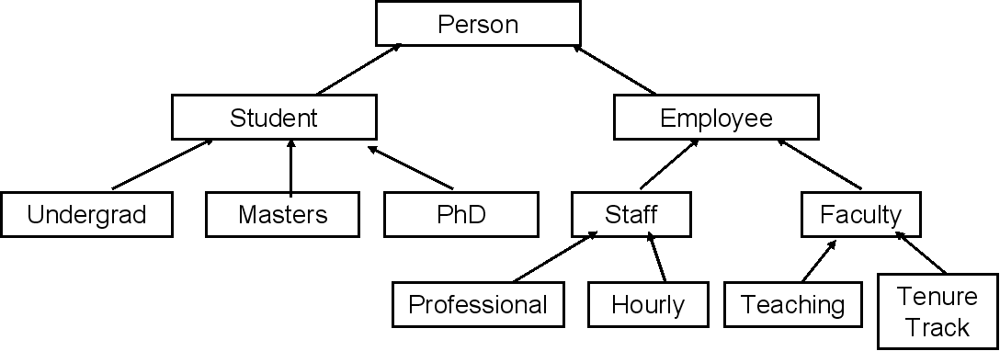

## Section 15 - Inheritance

### What is Inheritance

#### Overview

- Provides a method for creating new classes from existing classes
	- The new class contains the data and behaviors of the existing class
- Allows for reuse of existing classes
	- Modeling similar behavior across multiple classes would otherwise require lots of code duplication
- Allows new classes to mofiy behaviors of existing classes to make it unique without actually modifying the original class
	- the original class probably has already been  tested and may be being used by other programs, so we want to avoid modifying it
	- Allows us to not have to rewrite features from the underlying class in the new class - reduces the possiblity of error
- Inheritance must make sense - leverage commonality amongst classes
	- Teacher, Administrator, and   


##### Examples of Related Classs:

- Person, Employee, Student, Faculty, Staff, Administrator
	- Person is underlying class
	- Employee can be a child class of Person and a parent class for Facutly, Staff, and Administrator
- Character, Player, Enemy, LevelBoss, Civilian, etc.
	- All Characters will have data fields such as name, health and location
	- The Player class will also have an XP field and a money field 
	- Enemy and LevelBoss classes will probably also have a field that indicates which loot items they drop
- etc.

Account Classes:

- Account
	- balance, deposit, withdraw
-  Savings
	- balance, deposit, withdraw, interest rate, etc.
- Checking
	- balance, deposit, withdraw, minimum balance, overdraft fee, etc. 
-  Trust
	-  balance, deposit, withdraw, trustee, etc.

	
#### Terminology 

- Inheritance: the process of creating new classes from an existing class
	- Single Inheritance: a new class is created from another "single" class
	- Multiple Inheritance: a new class is created from two (or more) other classes

- Base Class (parent class, super class): the class being extended or inherited from 
- Derived Class (child class, sub class): the class being created from the Base class. Will inherit attributes and operations from the Base class

- "Is-A" Relationship
	- (Classic) Public inheritance
	- Derived classes are sub-types of their Base classes
		- "A Circle **is a** Shape", "A Savings Account **is an** Account", "An Enemy **is a** Character", etc.  
	- Can use a derived class wherever we use a base class object
- Generalization: combining similar classes into a single, more general class based on common attributes
	- general class is more abstract and can potentially be reused more easily 
- Specialization: creating new classes from existing classes providing more specialized attributes or operators
	- opposite of generalization 
- Inheritance or Class Hierarchies: organization of our inhertitance relationships 
	- Use generalization or specialization to create Class Hierarchies 
	- [UML Class Diagram](https://www.visual-paradigm.com/guide/uml-unified-modeling-language/uml-class-diagram-tutorial/) - how we display class hierarchies and relationships
	- Inheritance is transitive




In this image:

- Person
	- Student
		- Undergrad
		- Masters
		- PhD 
	- Employee 
		- Staff
			- Professional
			- Hourly 
		- Faculty
			- Teaching/Lecturer
			- Tenure Track  

Inheritance is transitive so in the above example:

- an Undergrad is a Student, and a Student is a Person, so an Undergrad is a Person
- a Lecturer is a Faculty member, and a Faculty member is an Employee, and an Employee is a Person
	- A Lecturer is therefore a Faculty member, Employee, and a Person
- a Professional is a Staff member, and a Staff member is an Employee, and an Employee is a Person
	- A Professional is therefore a Staff Member, Employee, and a Person
-  While Lecturers and Professionals are both Employees
	- a Lecturer is **not** a Staff member
	- a Professional is **not** a Faculty member  

Inheritance is not-bidrectional:

- A Person is not an Employee


### Inheritance vs. Composition

- Both inheritance and composition allow for reuse of existing classes
- Public Inheritance uses "Is-A" relationships
- Composition uses "Has-A" relationships
	- e.g. "a Person **has an** account", "Player **has a** Special Attack"
	- used for situations where the "Is-A" relationship doesn't apply
	- Create the association at the highest level where it applies - this associate will flow down to all derived classes
		- e.g. if `Person` has an `Account` than so will `Student` and `Employee` and all their derived classes
	- Technically, when we model class data members we are using compoistion. These instance variables are gnerally perimitive types so we don't model them in class diagrams, but the concept is the same.
- Rule of Thumb: if you can model a relationship with composition, you should do that instead of using inheritance

Declaring a Class using Composition

```
class Person{
	private:
		std::string name; //has-a name
		Account account; //has-a account
}
```  

### Deriving Classes from Existing Classes

Start with the class declaration for the base class

```
class BaseClass {
	// Base class members ...
};
```

Then declare the derived class

```
class DerivedClass: access-specifier BaseClass{
	// Derived class members ...
};
```

- `access-specifier` can be `public`, `private`, or `protected`.
	- if you don't provide and `access-specifier` then `private` inheritance is used 
	- Most object oriented languages only support public inheritance
	- [public, private, and protected inheritance](https://www.programiz.com/cpp-programming/public-protected-private-inheritance) overview
- `BaseClass` is the name of the base class 
- `DerivedClass` is the name of the class derived from the base class
- Note: generally the derived class should be less complicated than the base class

Access Specifiers

- `public`
	- most common
	- establishes an "is-a" relationship between the derived and base classes
- `private` and `protected`
	- establishes a "derived class **has a** base class" relationship
	- "is implemented in terms of" relationship
	- beyond the scope of this course

Example - `Account` and `Savings_Account` classes

```
class Account{
	// Account class members ...
};

class Savings_Account: public Account{
	// Savings_account class members ...
};
```

- This implementation means `Savings_Account` is a `Account`
- `Saving_Account` has access to everything in the `Account` class and can implement its own special behaviors
	- the derived class can override any methods inherited from the base class
	- In our `Account` and `Savings_Account` example, you could implement separate `withdraw` and `deposit` methods in `Savings_Account` than what you inherited from the `Account` class.
- We can now create `Account` and `Savings_Account` objects

### Protected Members and Class Access

The `protected` class member modifier:

```
class Base {
	protected:
		// protected base class members ...
};
```

- The `protected` class members
	- accessible from the `Base` class itself
	- Accessible from classes derived from `Base` using public inheritance or protected
		-  accessible from the class means that class members can access it
	- Not accessible by objects of `Base` or `Derived`
		- Act like `private` members in this regard
		- Basically behave like `private` members unless inheritance is involved


Example:

```
class Base{
	public:
		int a; //public Base class members
	
	protected:
		int b; //protected Base class members
	
	private:
		int c; //private Base class members
};
``` 
|                                             Base Class | Inheritance Type | Derived Class                                                            |
|-------------------------------------------------------:|:----------------:|--------------------------------------------------------------------------|
| `public`: `a` <br> `protected`: `b` <br>`private`: `c` |      public      | `public` : `a` <br>`protected`: `b` <br>`private`: Inherited but Not Accessible    |
| `public` : `a` <br>`protected`: `b` <br>`private`: `c` |     protected    | `protected` : `a` <br>`protected`: `b` <br>`private`: Inherited but Not Accessible |
| `public` : `a` <br>`protected`: `b` <br>`private`: `c` |      private     | `private` : `a` <br>`private`: `b` <br>`private`: Inherited but Not Accessible     |

- Access with Public Inheritance
	- `public` class members are inherited and are `public` in the derived class
	- `protected` class members are inherited and are `protected` in the derived class
	- `private` class members are inherited but the derived class does not have access to them
		- any attempt to access base class `private` class members from the derived class will result in a compiler error 
- Access with `protected` Inheritance - Remember: this is not "is-a" inheritance
	- `public` class members are inherited and are **`protected`** in the derived class
	- `protected` class members are inherited and are `protected` in the derived class
	- `private` class members are inherited but the derived class does not have access to them
		- any attempt to access base class `private` class members from the derived class will result in a compiler error 
- Access with `private` Inheritance - Remember: this is not "is-a" inheritance
	- `public` class members are inherited and are **`private`** in the derived class
	- `protected` class members are inherited and are **`private`** in the derived class
	- `private` class members are inherited but the derived class does not have access to them
		- any attempt to access base class `private` class members from the derived class will result in a compiler error 
- If you need to access a `private` variable in a derived class, you will need to use a getter or a setter from the base class


### Constructors and Destructors with Inheritance

#### Constructors and Class Initialization

- a derived class does **not** inherit
	- base class constructors (including default, copy, and move)
	- base class destructors
	- base class overloaded assignment operators
	- base class friend functions
- However, the derived class constructors, destructors, and overloaded assignment operators can invoke the base class versions
- C++11 allows explicit inheritnace of base 'non-special' constructors with
	- `using Base::Base;` anywhere in the derived class declaration
	- Lots of rules involved, better to define constructors yourself  


#### Constructors


- The base part of the derived class must be initialized before the derived class is initialized
	- When a derived object is created: the base class constructor executes **then** the derived class constructor executes


#### Destructors

- Class destructors are invoked in the reverse order as constructor - the derived part of the derived class **must** be destroyed **before** the base class destructor is invoked
	- When a derived object is destroyed: the derived class destructor exectutes **then** the base class destructor executes
	- Each destructor should free resources allocated in its own constructors

#### Example

```
class Base {
	public:
		// Constructor
	   	Base(){ 
	   		cout << "Base no-args constructor" << endl; 
	    }
	    
	    // Destructor
	    ~Base(){ cout << "Base destructor" << endl; }
};

class Derived : public Base {
	public:
	
		// Constructor
	    Derived(){
	    	cout << "Derived no-args constructor " << endl; 
	    }
	    
	    // Destructor
	    ~Derived(){ cout << "Derived destructor " << endl; }
};

int main(){
	Base base_object {}; 	
	Derived derived_object {};
	return 0
}
```

- `Base base_object{}` creates a `Base` object. The output reads `Base no-args constructor`
	- when `base_object` is destroyed the output reads `Base destructor`. 
- `Derived derived_object {};` creates a `Derived` object. The output reads `Base no-args constructor` and then (on a new line) `Derived no-args constructor`. This is because the `Base` class constructor executes before the `Derived` class constructor
	- when `derived_object` is destroyed the output reads: `Derived destructor` followed (on a new line) by `Base destructor`. This is because the destructors are invoked in the opposite order that the constructors were invoked. That means the derived class's destructors are invoked before the base class's constructors

### Passing Arguments to Base Class Constructors

- base part of a derived class must be initialized first - that means the base constructor must be invoked to do that initialization
	- we can invoke whichever base class constructor we wish in the initialization list of the derived class

```
class Base{
public:

	// Declaring the Base class constructor
	Base();
	Base(int);
	...
};

// Implementing the Derived class Constructor
Derived::Derived(int x) 
	: Base(x), {optional initializers for Derived} { //initialization list
	
	// code

}
```

- if we don't explicitly invoke the desired `Base` class constructor, then the no-args constructor will be invoked automatically

```
using namespace std;

class Base {
	private:
	    int value;
	public:
	   Base() : value{0} { cout << "Base no-args constructor" << endl; }
	   Base(int x) : value{x} { cout << "Base (int) overloaded constructor" << endl; }
	   ~Base(){ cout << "Base destructor" << endl; }
};

class Derived : public Base {
    using Base::Base;
private:
    int doubled_value;
public:
	Derived()
        :Base {}, doubled_value {0} { // explicitly calls the Base no-args constructor
            cout << "Derived no-args constructor " << endl; 
   	}
    Derived(int x) 
        :  Base{x},  doubled_value {x * 2} {  // calls the overloaded Base constructor
            cout << "Derived (int) constructor" << endl; 
    }
    ~Derived() { cout << "Derived destructor " << endl; }
}; 
```

| Code                     | Output                                                    |
|--------------------------|-----------------------------------------------------------|
| `Base base;`             | Base no-args constructor                                  |
| `Base base {100};`       | int Base constructor                                      |
| `Derived derived;`       | Base no-args constructor <br> Derived no-args constructor |
| `Derived derived {100};` | int Base constructor <br> Derived Base constructor        |


### Copy/Move Constructors and Operator= with Derived Classes

- Copy and Move constructors and Copy/Move assignment operators are not inherited from the Base class
- You may not need to provide your own - the compiler-provided versions may be just fine
- We can explicitly invoke the Base class versions from the Derived class


#### Copy/Move Constructor

Note: these notes are written for the Copy Constructor but the Move Constructor works the same way

- Can invoke Base copy constructor explicilty - the code below invokes the `Base` copy consturctor in the `Derived` copy constructor initialization list
	- Because we are using "is-a" inheritance, a `Derived` is a `Base`. That means we can pass in a `Derived` to a method that expects a `Base`
	- The `Base` part of the `Derived` object '*other*' will be **sliced** and passed to the `Base` constructor

```
Derived::Derived( const Derived &other)
	: Base(other), {Derived initialization list} {		//code
}
```

##### Example

```
class Base {
	private:
	    int value;
	public:
	   // Same constructors and destructors as before
	   
	   // Copy Constructor
	   Base(const Base &other) 
        : value {other.value} {
         cout << "Base copy constructor" << endl;     
    	}
};

class Derived : public Base {
    using Base::Base;
private:
    int doubled_value;
public:
	// Same constructors and destructors as before
	
	Derived(const Derived &other)
        : Base(other), doubled_value {other.doubled_value} {
         cout << "Derived copy constructor" << endl;     
    }
}; 
```


#### Copy/Move Assignment Operator `operator=`

Note: these notes are written for the Copy Assignment Operator but the Move Assignment Operator works the same way


```
class Base {
	private:
	    int value;
	public:
	   // Same constructors and destructors as before

		Base &operator=(const Base &rhs)  {
	   		cout << "Base operator=" << endl;
	    
	    	// check for self assignment
	        if (this != &rhs){
	            value = rhs.value;
	        }
	        return *this;
	    }
};

class Derived : public Base {
    using Base::Base;
private:
    int doubled_value;
public:
	// Same constructors and destructors as before
	
	Derived &operator=(const Derived &rhs) {
			cout << "Derived operator=" << endl;
	        if (this != &rhs){
	        	Base::operator=(rhs); // Assign Base Part
		     	doubled_value = rhs.doubled_value; // Assign Derived Part
	        }
	        return *this;
	}
}; 
```

`Base::operator=(rhs);` passes in the `rhs` to the `Base` class's overloaded assignment operator. If we don't explicilty make this call, then the base part will not be assigned

#### Inhertance with Copy/Move constructors and overloaded `operator=`

- Often you do not need to provide your own
- If you do **not** define them in `Derived`, then the compiler will create them automatically and call the base class's version
- if you do provide `Derived` versions, then **you** must invoke the `Base` versions **explicitly** yourslef
- Be careful with raw pointers, especially if Base and Derived each have raw pointers. 
	- Provide them with deep copy semantics


### Redefining Base Class Methods:

- Derived class can directly invoke base class methods 
- derived class can override or redefine base class methods
- Very powerful in the context of polymorphism (next section)


To redefine or override a method, you simply provide a method in the derived class with the same name and signature as a method in the base class.

- a function/method signature consists of the function/method name and the number and type of its parameters. This is essentially the same as the function prototype.

#### Example:


```
// Account Class with Deposit Method
class Account{
protected:
    double balance;
public:
	void deposit(double amount){
		balance += amount;
}
```

Create an `Account` class with a `deposit` method

```
class Savings_Account: public Account{
protected:
	double int_rate; // in percent
public: 
	void deposit(double amount){
		amount = amount + (amount * int_rate/100);
		Account:: deposit(amount);
	}
}
```

Going Through the Code

- `class Savings_Account: public Account` creates a derived class `Savings_Account` whose base class is `Account`
- `void deposit(double amount)` redefines the base `deposit` method for `Savings_Account` class
	- notice that the number (1) and type (`double`) of the redefined deposit method's arguments are the same as those of the base class's deposit method. This is because the signature needs to be the same, not just the method name. 
- `Account::deposit(amount)` calls the base class version of ther `deposit` method
	- We want to take advantage of some of the functionality in the `Account` class's `deposit` method, so we call it here. No need to duplicate code.  
	- Must prefix the method call with the `Account` class so the compiler knows taht we're calling the `Account` class's `deposit` method.

	
### Static Binding

- Static binding means that the compiler determines which methods are called based on what it sees at compile time. 
	- This is very efficient - default binding for C++ is static
	- derived class objects with use `Derived::deposit`, but we can explicitly invoke `Base::deposit` from `Derived::deposit`
	- This is okay, but limited. We sometimes want binding to occur at runtime. This is called dynamic binding


```
Base b // b is a Base object
b.deposit(100.0); // Base::deposit

Derived d // d is a Derived object
d.deposit(100.0); //Derived::deposit

Base *ptr = new Derived(); //This is valid because a Derived is a Base
ptr->deposit(1000) //compiler Base::deposit, but we may actually want to call Derived::deposit
```

For `Base *ptr = new Derived();`, check out [this](https://www.geeksforgeeks.org/object-slicing-in-c/) page on Object Slicing in C++.

### Multiple Inheritance in C++

- Multiple Inheritance is when a derived class inherits from two or more base classes at the same time
	- Base class may belong to unrelated hierarchies
	- An example that could apply to our univeristy persons class hierarchy is a `Department Chair` class that inherits from the Faculty Class and the Administrator Class
		- a department chair is a faculty member and is an administrator
	- Has some compelling use cases
		- we can usually change our design so we don't need it
	- Can be very complex
		- oftentimes this complexity causes it to be misued
- Multiple inheritance is beyond the scope of this course. 
	- See [this](https://www.geeksforgeeks.org/multiple-inheritance-in-c/) link for more information

    